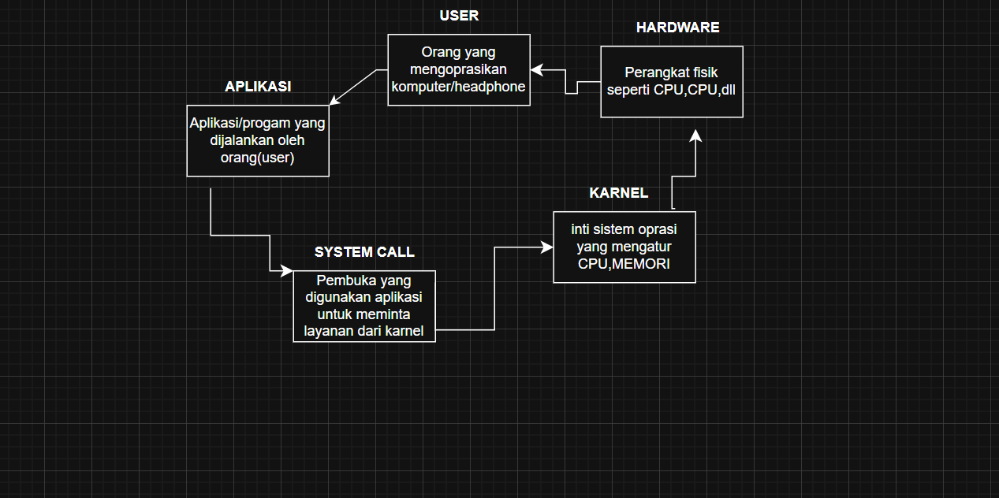

# Laporan Praktikum Minggu [1]
Topik: [ Arsitektur Sistem Operasi dan Kernel]

---

## Identitas
- **Nama**  : [Asyifani Lutfiana Nadzif]  
- **NIM**   : [250202931]  
- **Kelas** : [1ikrb]

---

## Tujuan
Tuliskan tujuan praktikum minggu ini:  
-  mampu menjelaskan fungsi utama sistem operasi dan peran kernel serta system call.
- Dapat menjelaskan  peran sistem oprasi dalam arsitektur komputer.
- Mengidentifikasi komponen utama OS (kernel, system call, device driver, file system).
- Membandingkan model arsitektur OS (monolithic, layered, microkernel).
- Menggambarkan diagram sederhana arsitektur OS menggunakan alat bantu digital (draw.io / mermaid).


---

## Dasar Teori
Sistem Operasi (Operating System) adalah perangkat lunak sistem yang berfungsi sebagai penghubung antara pengguna (user) dan perangkat keras (hardware) komputer.
Sistem operasi mengelola sumber daya komputer seperti CPU, memori, penyimpanan, dan perangkat input/output agar dapat digunakan secara efisien oleh aplikasi dan pengguna dan mencakup beberapa  lapisan seperti karnel, system call dan arsitektur OS.


---

## Langkah Praktikum
1. Menginstal aplikasi Github,dan Visual Studio Code.
2. Membuka terminal shell/ Command Prompt.
3. menjalankan beberapa perintah untuk melihat sistem  dan karnel.
4. uname -a yaitu menampilkan informasi karnel dan sistem oprasi 
5. whoami menampilkan user yang sedang login
6. Ismod |head menampilkan modul karnel  yang sedang aktif
7. dmesg |head menampilkan pesan karnel sistem booting.
8. Dan menganalisis hasil keluaran perintah- perintah tersebut.

---

## Kode / Perintah
Tuliskan potongan kode atau perintah utama:
```bash
uname -a
whoami
lsmod | head
dmesg | head
```

---

## Hasil Eksekusi
Sertakan screenshot hasil percobaan atau diagram:

! [scrennshot hasil](./screenshots/Linux.png)


---

## Analisis
- 1. uname  -a  menampilkan informasi lengkap tentang sistem oprasi dan karnel yang sedang digunakan.
- 2. Whoami pengguna yang sedang menjalankan terminal.
- 3. Ismod |head menampilkan daftar modul karnel yang sedang aktif di sistem Linux.
- 4. dmesg |head  menampilkan pesan karnel yang direkam sejak sistem booting. 
    -   Perbedaan yg terdapat pada karnel,system call, dan arsitektur os:
- 1. Karnel  mengatur perangkat keras, modul, dan sumber daya sistem pada uname, ismod dan dmesg
- 2.  system call  yaitu jembatan komunikasi antara user mode dan karnel mode yang digunakan oleh semua perintah.
- 3. arsitektur os yaitu struktur kerja sistem oprasi secara perlapis dan terpisah  yang terdapat pada user, system call, karnel, dan hardware.

- Apa perbedaan hasil di lingkungan OS berbeda (Linux vs Windows)?  
- 1. Pada Linux hail percobaan akan lebih lengkap dan detail karena semua perintah (seperti name,ismod,dan dmesg)berhubungan langsung dengan karnel.
- 2. sedangkan di windows hanya whoami yang memberikan hasil serupa. perintah lain membutuhkan alat atau antarmuka berbeda karena sistem oprasu ini tidak memberikan akses langsung ke karnel dan system call.

---

## Kesimpulan
- 1. Hasil praktikum pada Linux menunjukkan bahwa sistem ini transparan dan memungkinkan pengguna melihat secara langsung aktivitas kernel dan modul. Sedangkan pada Windows, sebagian fungsi kernel tersembunyi dan hanya dapat diakses melalui antarmuka grafis (GUI) atau alat khusus.
- 2. Secara keseluruhan, praktikum ini membantu memahami bagaimana komponen sistem operasi saling berinteraksi mulai dari user, system call, kernel, hingga hardware serta menunjukkan bahwa Linux merupakan platform yang ideal untuk mempelajari konsep internal sistem operasi.


---

## Quiz
1. [sebutkan 3 fungsi utama sistem oprasi]  
   **Jawaban:**  
   -   pengatur sumber daya komputer
   - penyedia antarmuka antar pengguna dan perangkat keras,
   - serta pengendali eksekusi program.
2. [jelaskan perbedaan antara karnel mode dan user mode.]  
   **Jawaban:**  
   - karnel mode digunakan untuk menjalankan fungsi yang kritis
   - sedangkan user mode digunakan untuk menjalankan aplikasi pengguna. perpindahan dari user mode ke karnel mode terjadi melalui system call.
3. [sebutkan contoh OS  dengan arsitektur  monolithic dan microkarnel.]  
   **Jawaban:**  
   - monolithic karnel  contoh OS yaitu Linux,UNIX,MS-DOS
   - Microkarnel contoh OS yaitu Minix, QNX,mach (macOS).

---

## Refleksi Diri
Tuliskan secara singkat:
- Bagian yang paling menantang minggu ini menurut saya  adalah memahami hubungan antara karnel, system call  dan arsitektur os , terutama perintah terminal  seperti uname -a,whoami,ismod |head,dan dmesg |head yang ternyata berkaitan lagsung dengan karnel.
- Bagaimana cara Anda mengatasinya?  
cara saya mengatasinya yaitu saya mempelajari  teori arsitektur OS serta menganalisis hasil perintah secara langsung di Linux  dan saya dapat melihat bukti nyata bagaimana karnel bekerja  dalam mengatur perangkat keras dan komunikasi sistem.
---

**Credit:**  
_Template laporan praktikum Sistem Operasi (SO-202501) – Universitas Putra Bangsa_
