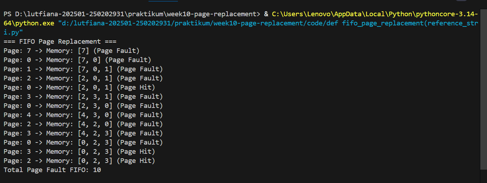

# Laporan Praktikum Minggu [10]
Topik: [Manajemen Memori – Page Replacement (FIFO & LRU)]

---

## Identitas
- **Nama**  : [Asyifani Lutfiana Nadzif]  
- **NIM**   : [250202931]  
- **Kelas** : [1IKRB]

---

## Tujuan
Tuliskan tujuan praktikum minggu ini.  
Contoh:  
>1.  Mengimplementasikan algoritma page replacement FIFO dalam program.
>2.  Mengimplementasikan algoritma page replacement LRU dalam program.
>3. Menjalankan simulasi page replacement dengan dataset tertentu.
>4. Membandingkan performa FIFO dan LRU berdasarkan jumlah page fault.
>5. Menyajikan hasil simulasi dalam laporan yang sistematis.


---

## Dasar Teori
1. Manajemen Memori Virtual
Sistem operasi modern menggunakan memori virtual untuk memberikan ilusi bahwa setiap proses memiliki ruang memori yang besar dan kontigu, meskipun memori fisik (RAM) terbatas.
2. Page Fault
Page fault terjadi ketika sebuah page yang diakses oleh proses tidak berada di memori utama (RAM).
3. Page Replacement Algorithm
Page replacement algorithm adalah algoritma yang menentukan halaman mana yang harus dikeluarkan dari memori ketika terjadi page fault dan tidak tersedia frame kosong.
4. . Algoritma FIFO (First-In First-Out)
Konsep Dasar
FIFO mengganti halaman berdasarkan urutan kedatangan.
Halaman yang paling lama berada di memori akan diganti terlebih dahulu.
5. Algoritma LRU (Least Recently Used)
Konsep Dasar
LRU mengganti halaman yang paling lama tidak digunakan.
---

## Langkah Praktikum
1. Menyiapkan dataset
2. Implementasi FIFO
3. Implementasi LRU
4. Lakukan eksekusi menggunakan dataset
5. screenshot hasil eksekusi
6. push ke GitHub dengan comit yang telah disediakan.
---

## Kode / Perintah
Tuliskan potongan kode atau perintah utama:
```bash
def fifo_page_replacement(reference_string, frames):
    memory = []
    page_faults = 0
    index = 0

    print("=== FIFO Page Replacement ===")
    for page in reference_string:
        if page not in memory:
            page_faults += 1
            if len(memory) < frames:
                memory.append(page)
            else:
                memory[index] = page
                index = (index + 1) % frames
            status = "Page Fault"
        else:
            status = "Page Hit"

        print(f"Page: {page} -> Memory: {memory} ({status})")

    print(f"Total Page Fault FIFO: {page_faults}\n")
    return page_faults


def lru_page_replacement(reference_string, frames):
    memory = []
    page_faults = 0
    recent_use = {}

    print("=== LRU Page Replacement ===")
    for i, page in enumerate(reference_string):
        if page not in memory:
            page_faults += 1
            if len(memory) < frames:
                memory.append(page)
            else:
                lru_page = min(memory, key=lambda p: recent_use[p])
                memory[memory.index(lru_page)] = page
            status = "Page Fault"
        else:
            status = "Page Hit"

        recent_use[page] = i
        print(f"Page: {page} -> Memory: {memory} ({status})")

    print(f"Total Page Fault LRU: {page_faults}\n")
    return page_faults


if __name__ == "__main__":
    reference_string = [7, 0, 1, 2, 0, 3, 0, 4, 2, 3, 0, 3, 2]
    frames = 3

    fifo_faults = fifo_page_replacement(reference_string, frames)
    lru_faults = lru_page_replacement(reference_string, frames)

    print("=== Perbandingan ===")
    print(f"FIFO Page Faults: {fifo_faults}")
    print(f"LRU Page Faults : {lru_faults}")

```

---

## Hasil Eksekusi
Sertakan screenshot hasil percobaan atau diagram:

.png)

---

## Analisis
- Tabel simulasi FIFO
  
 | Langkah | Page | Frame 1 | Frame 2 | Frame 3 | Status | Keterangan                    |
| :-----: | :--: | :-----: | :-----: | :-----: | :----: | :---------------------------- |
|    1    |   7  |    7    |    -    |    -    |  Fault | Frame kosong, page dimasukkan |
|    2    |   0  |    7    |    0    |    -    |  Fault | Frame kosong                  |
|    3    |   1  |    7    |    0    |    1    |  Fault | Frame kosong                  |
|    4    |   2  |    2    |    0    |    1    |  Fault | 7 keluar (paling awal masuk)  |
|    5    |   0  |    2    |    0    |    1    |   Hit  | Page sudah ada                |
|    6    |   3  |    2    |    3    |    1    |  Fault | 0 keluar                      |
|    7    |   0  |    2    |    3    |    0    |  Fault | 1 keluar                      |
|    8    |   4  |    4    |    3    |    0    |  Fault | 2 keluar                      |
|    9    |   2  |    4    |    2    |    0    |  Fault | 3 keluar                      |
|    10   |   3  |    4    |    2    |    3    |  Fault | 0 keluar                      |
|    11   |   0  |    0    |    2    |    3    |  Fault | 4 keluar                      |
|    12   |   3  |    0    |    2    |    3    |   Hit  | Page sudah ada                |
|    13   |   2  |    0    |    2    |    3    |   Hit  | Page sudah ada                |

hasil nya yaitu
Page Fault: 10 kali
page Hit: 3 kali

- Tabel simulasi LRU
  
| Langkah | Page | Frame 1 | Frame 2 | Frame 3 | Status |
| :-----: | :--: | :-----: | :-----: | :-----: | :----: |
|    1    |   7  |    7    |    -    |    -    |  Fault |
|    2    |   0  |    7    |    0    |    -    |  Fault |
|    3    |   1  |    7    |    0    |    1    |  Fault |
|    4    |   2  |    2    |    0    |    1    |  Fault |
|    5    |   0  |    2    |    0    |    1    |   Hit  |
|    6    |   3  |    2    |    0    |    3    |  Fault |
|    7    |   0  |    2    |    0    |    3    |   Hit  |
|    8    |   4  |    4    |    0    |    3    |  Fault |
|    9    |   2  |    4    |    0    |    2    |  Fault |
|    10   |   3  |    4    |    3    |    2    |  Fault |
|    11   |   0  |    0    |    3    |    2    |  Fault |
|    12   |   3  |    0    |    3    |    2    |   Hit  |
|    13   |   2  |    0    |    3    |    2    |   Hit  |

Hasilnya Yaitu:
Page Fault: 9
Page Hit: 4

 Jadi dari hasil simulasi algoritma LRU menghasilkan page fault lebih sedikit dibanding FIFO. Hal ini karena LRU mempertimbangkan riwayat penggunaan halaman (locality of reference).

- Hasil perbandingan FiFO dan LRU
 
 | Algoritma | Jumlah Page Fault | Keterangan                                                                               |
| :-------- | :---------------: | :--------------------------------------------------------------------------------------- |
| FIFO      |         10        | Mengganti halaman berdasarkan urutan kedatangan tanpa memperhatikan frekuensi penggunaan |
| LRU       |         9         | Mengganti halaman yang paling lama tidak digunakan sehingga lebih adaptif                |

- Algoritma FIFO (First-In First-Out) mengganti halaman yang paling lama berada di memori, tanpa mempertimbangkan apakah halaman tersebut masih sering digunakan.
Sebaliknya, algoritma LRU (Least Recently Used) mengganti halaman yang paling lama tidak digunakan
- Berdasarkan hasil simulasi, algoritma LRU lebih efisien dibandingkan FIFO. Hal ini dibuktikan dengan jumlah page fault yang lebih sedikit.
- LRU lebih efisien karena:
1. Mempertimbangkan riwayat penggunaan halaman.
2. Menjaga halaman yang masih sering diakses tetap berada di memori.
3. Lebih sesuai dengan pola akses program nyata.
- Sementara itu, FIFO memiliki kelemahan karena:
1. Tidak mempertimbangkan frekuensi maupun pola akses halaman.
2. Dapat menyebabkan page fault lebih banyak.
3. Berpotensi mengalami Belady’s Anomaly.
---

## Kesimpulan
1. Algoritma LRU menghasilkan jumlah page fault yang lebih sedikit dibandingkan FIFO karena mempertimbangkan riwayat penggunaan halaman dan memanfaatkan prinsip locality of reference.
2. Algoritma FIFO lebih sederhana dalam implementasi, namun kurang efisien karena dapat mengganti halaman yang masih sering digunakan, sehingga berpotensi meningkatkan jumlah page fault.

---

## Quiz
1. Apa perbedaan utama FIFO dan LRU?  
   **Jawaban:** 
   FIFO mengganti halaman berdasarkan urutan kedatangan paling awal tanpa memperhatikan pola penggunaan, sedangkan LRU mengganti halaman yang paling lama tidak digunakan berdasarkan riwayat akses halaman. 
2. Mengapa FIFO dapat menghasilkan *Belady’s Anomaly*? 
   **Jawaban:**  
   FIFO dapat menghasilkan Belady’s Anomaly karena penambahan jumlah frame memori tidak selalu mengurangi jumlah page fault. Hal ini terjadi karena FIFO tidak mempertimbangkan frekuensi atau pola penggunaan halaman, sehingga halaman yang masih sering digunakan dapat tetap diganti hanya karena masuk lebih awal.
3. Mengapa LRU umumnya menghasilkan performa lebih baik dibanding FIFO?  
   **Jawaban:**  
   LRU umumnya menghasilkan performa lebih baik karena memanfaatkan prinsip locality of reference, yaitu kecenderungan program untuk mengakses halaman yang sama secara berulang. Dengan mempertahankan halaman yang baru digunakan, LRU mampu meminimalkan jumlah page fault dibanding FIFO.

---

## Refleksi Diri
Tuliskan secara singkat:
- Apa bagian yang paling menantang minggu ini?  
- Bagaimana cara Anda mengatasinya?  

---

**Credit:**  
_Template laporan praktikum Sistem Operasi (SO-202501) – Universitas Putra Bangsa_
