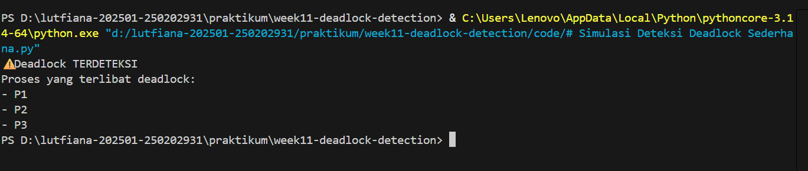

# Laporan Praktikum Minggu [11]
Topik: [Simulasi dan Deteksi Deadlock]

---

## Identitas
- **Nama**  : [Asyifani Lutfiana Nadzif]  
- **NIM**   : [250202931]  
- **Kelas** : [1IKRB]

---

## Tujuan
Tuliskan tujuan praktikum minggu ini.  
Contoh:  
>1. Membuat program sederhana untuk mendeteksi deadlock.
>2.  Menjalankan simulasi deteksi deadlock dengan dataset uji.
>3. Menyajikan hasil analisis deadlock dalam bentuk tabel.
> 4. Memberikan interpretasi hasil uji secara logis dan sistematis.
---

## Dasar Teori
Tuliskan ringkasan teori (3–5 poin) yang mendasari percobaan.

---

## Langkah Praktikum
1. Menyiapkan Dataset
2. implementasi Algoritma Deteksi Deadlock
3. Menjalankan algoritma deteksi deadlock
4. scrensshot hasil deteksi 
5. lalu push di GitHub dengan Commit yang telah disediakan

---

## Kode / Perintah
Tuliskan potongan kode atau perintah utama:
```bash
# Simulasi Deteksi Deadlock Sederhana
# Menggunakan Resource Allocation Graph (RAG)

# Data proses: (Process, Allocation, Request)
processes = [
    ("P1", "R1", "R2"),
    ("P2", "R2", "R3"),
    ("P3", "R3", "R1")
]

# Membuat Resource Allocation Graph
graph = {}

for process, allocation, request in processes:
    if request not in graph:
        graph[request] = []
    graph[request].append(allocation)

# Fungsi untuk mendeteksi cycle (deadlock)
visited = set()
stack = set()

def detect_cycle(node):
    if node in stack:
        return True
    if node in visited:
        return False

    visited.add(node)
    stack.add(node)

    for neighbor in graph.get(node, []):
        if detect_cycle(neighbor):
            return True

    stack.remove(node)
    return False

# Proses deteksi deadlock
deadlock = False
for node in graph:
    if detect_cycle(node):
        deadlock = True
        break

# Output hasil
if deadlock:
    print("⚠️ Deadlock TERDETEKSI")
    print("Proses yang terlibat deadlock:")
    for p in processes:
        print("-", p[0])
else:
    print("✅ Tidak terjadi deadlock")

```

---

## Hasil Eksekusi
Sertakan screenshot hasil percobaan atau diagram:


 -A.Hasil deteksi divalidasi secara logis dengan analisis manual:
- P1 memegang R1 dan menunggu R2
- P2 memegang R2 dan menunggu R3
- P3 memegang R3 dan menunggu R1

Terjadi siklus tunggu (circular wait) antar proses, sehingga hasil deteksi program sesuai dengan analisis manual.
---

## Analisis
- Tabel Hasil Deteksi Deadlock
  
| Proses |  Status  |
| :----: | :------: |
|   P1   | Deadlock |
|   P2   | Deadlock |
|   P3   | Deadlock |

- Berdasarkan hasil simulasi, seluruh proses berada dalam kondisi deadlock. Hal ini terjadi karena setiap proses memegang satu resource dan secara bersamaan menunggu resource lain yang sedang digunakan oleh proses lain, sehingga tidak ada proses yang dapat melanjutkan eksekusi.
Secara rinci:
1. Proses P1 memegang resource R1 dan menunggu R2.
2. Proses P2 memegang resource R2 dan menunggu R3.
3. Proses P3 memegang resource R3 dan menunggu R1.
   
Kondisi ini membentuk circular wait, yaitu P1 → P2 → P3 → P1, yang menyebabkan deadlock.

- Hasil deteksi deadlock pada simulasi ini sesuai dengan teori deadlock, karena keempat kondisi deadlock terpenuhi secara bersamaan:
1. Mutual Exclusion
Setiap resource hanya dapat digunakan oleh satu proses pada satu waktu.
2. Hold and Wait
Proses menahan resource yang sudah dimiliki sambil menunggu resource lain.
3. No Preemption
Resource tidak dapat diambil secara paksa dari proses yang sedang menggunakannya.
4. Circular Wait
Terjadi siklus tunggu antar proses, sehingga tidak ada proses yang dapat menyelesaikan eksekusi.

dari keempat kondisi tersebut terpenuhi, sistem berada dalam kondisi deadlock.

---

## Kesimpulan
1. Berdasarkan hasil simulasi, sistem berada dalam kondisi deadlock karena seluruh proses saling menunggu resource yang sedang digunakan oleh proses lain.
2. Deadlock terjadi karena keempat kondisi deadlock (mutual exclusion, hold and wait, no preemption, dan circular wait) terpenuhi secara bersamaan.
3. Algoritma deteksi deadlock mampu mengidentifikasi proses-proses yang terlibat deadlock secara tepat, sehingga membantu analisis dan penanganan deadlock dalam sistem operasi.

---

## Quiz
1. Apa perbedaan antara deadlock prevention, avoidance, dan detection? 
   **Jawaban:**  
- Deadlock Prevention
Mencegah deadlock dengan menghilangkan salah satu dari empat kondisi deadlock, sehingga deadlock tidak mungkin terjadi.
- Deadlock Avoidance
Menghindari deadlock dengan menganalisis kondisi aman (safe state) sebelum mengalokasikan resource, misalnya menggunakan Banker’s Algorithm.
- Deadlock Detection
Mengizinkan deadlock terjadi, kemudian mendeteksi deadlock setelah terjadi dan menentukan proses yang terlibat.
2. Mengapa deteksi deadlock tetap diperlukan dalam sistem operasi?
   **Jawaban:**  
 Deteksi deadlock tetap diperlukan karena tidak semua sistem dapat menerapkan pencegahan atau penghindaran deadlock secara efisien. Dalam sistem dengan alokasi resource dinamis dan kebutuhan yang tidak dapat diprediksi, deteksi deadlock memungkinkan sistem tetap berjalan normal dan menangani deadlock jika terjadi.
3. Apa kelebihan dan kekurangan pendekatan deteksi deadlock?  
   **Jawaban:**  
- Kelebihan:
>- Lebih fleksibel dalam pengelolaan resource.
>- Tidak membatasi proses secara ketat seperti prevention atau avoidance.
>- Cocok untuk sistem dengan kebutuhan resource dinamis.
- Kekurangan:
>- Deadlock sudah terjadi saat terdeteksi.
>- Memerlukan mekanisme pemulihan (recovery) tambahan.
>- Dapat menimbulkan overhead saat proses deteksi dijalankan.

---

## Refleksi Diri
Tuliskan secara singkat:
- Apa bagian yang paling menantang minggu ini?  
- Bagaimana cara Anda mengatasinya?  

---

**Credit:**  
_Template laporan praktikum Sistem Operasi (SO-202501) – Universitas Putra Bangsa_
