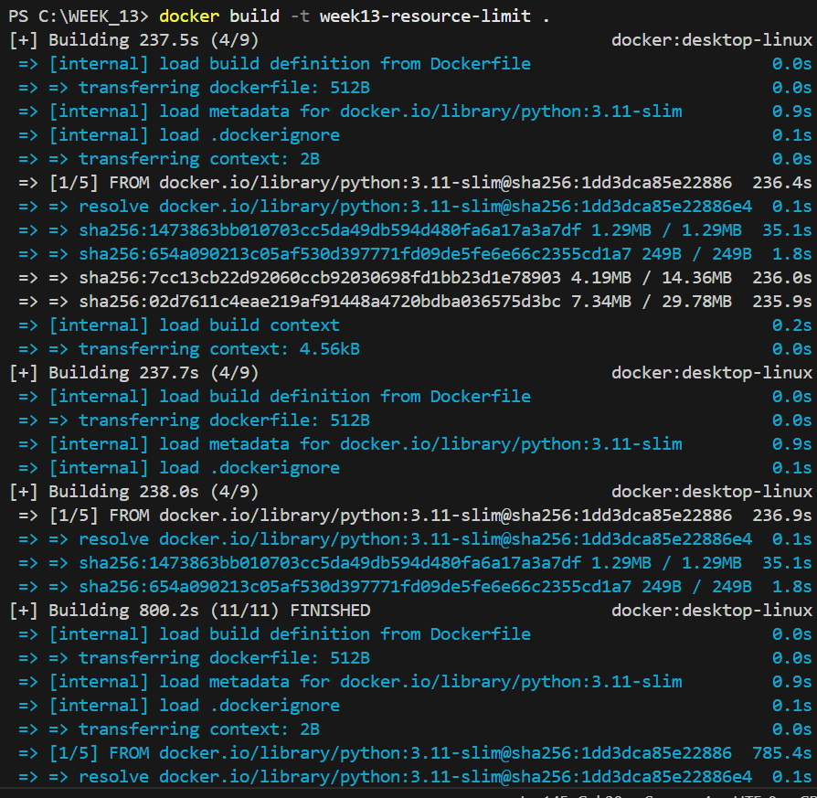
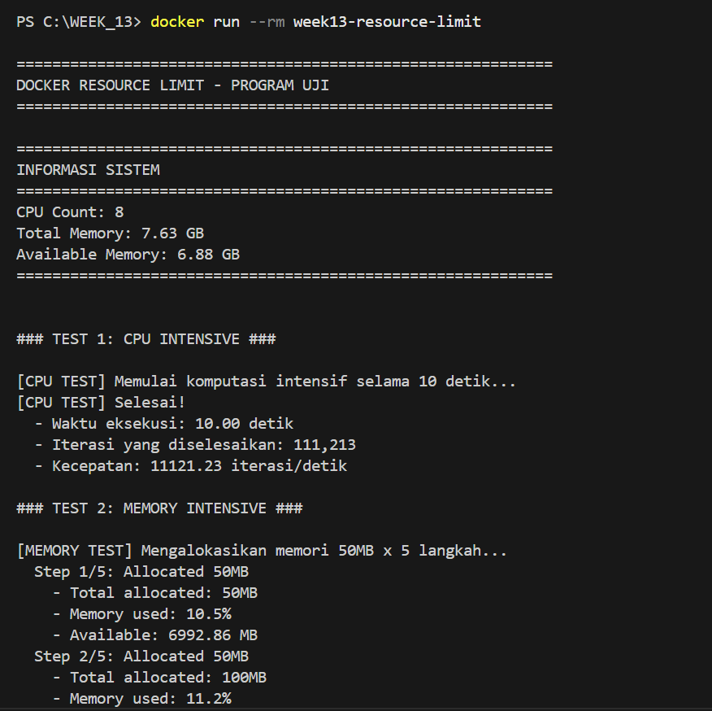
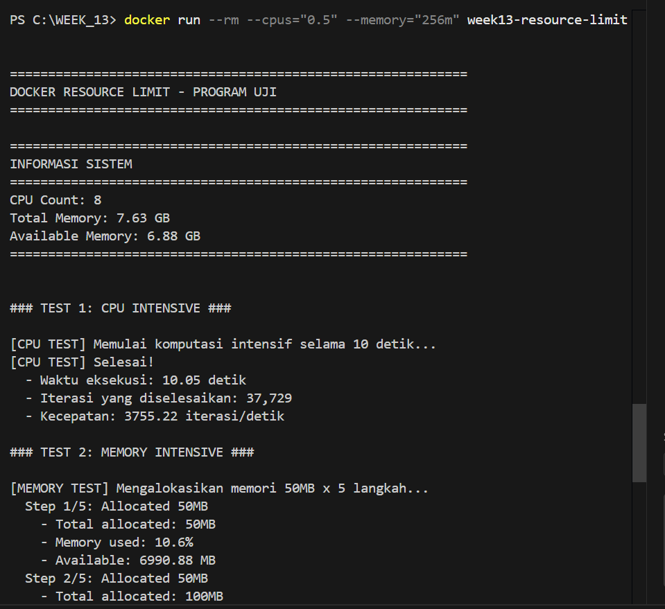

# Laporan Praktikum Minggu [13]
Topik:Docker – Resource Limit (CPU & Memori)


---

## Identitas
- **Nama**  : [Asyifani Lutfiana Nadzif]  
- **NIM**   : [250202931]  
- **Kelas** : [1IKRB]

---

## Tujuan
Tuliskan tujuan praktikum minggu ini.  
Contoh:  
>- Menulis Dockerfile sederhana untuk sebuah aplikasi/skrip.
>- Membangun image dan menjalankan container.
>- Menjalankan container dengan pembatasan CPU dan memori.
---

## Dasar Teori
1. Containerization dan Docker
Docker adalah platform containerization yang memungkinkan aplikasi dijalankan dalam lingkungan terisolasi yang disebut container. Container berbagi kernel sistem operasi host, namun memiliki ruang kerja sendiri seperti sistem file, jaringan, dan proses. Berbeda dengan Virtual Machine, container lebih ringan karena tidak memerlukan sistem operasi guest.
2. Manajemen Sumber Daya Sistem Operasi
Dalam sistem operasi, setiap proses membutuhkan sumber daya seperti:
- CPU (Central Processing Unit)
- Memori (RAM)
- Disk dan jaringan
Jika tidak dikontrol, satu proses dapat menghabiskan seluruh sumber daya sehingga menyebabkan proses lain menjadi lambat atau bahkan gagal berjalan.
3. Pembatasan CPU pada Docker
Pembatasan CPU bertujuan agar container hanya menggunakan CPU sesuai batas yang ditentukan.
Docker menyediakan beberapa mekanisme, antara lain:
> a. --cpus → Membatasi jumlah core CPU yang dapat digunakan
> 
>b. --cpu-shares → Menentukan prioritas penggunaan CPU

> c. --cpu-quota dan --cpu-period → Mengatur waktu eksekusi CPU
> 
Dengan pembatasan ini, container tidak akan mendominasi penggunaan CPU pada host.

---

## Langkah Praktikum
1. **Persiapan Lingkungan**

   - Pastikan Docker terpasang dan berjalan.
   - Verifikasi:
     ```bash
     docker version
     docker ps
     ```

2. **Membuat Aplikasi/Skrip Uji**

   Buat program sederhana di folder `code/` (bahasa bebas) yang:
   - Melakukan komputasi berulang (untuk mengamati limit CPU), dan/atau
   - Mengalokasikan memori bertahap (untuk mengamati limit memori).

3. **Membuat Dockerfile**

   - Tulis `Dockerfile` untuk menjalankan program uji.
   - Build image:
     ```bash
     docker build -t week13-resource-limit .
     ```

4. **Menjalankan Container Tanpa Limit**

   - Jalankan container normal:
     ```bash
     docker run --rm week13-resource-limit
     ```
   - Catat output/hasil pengamatan.

5. **Menjalankan Container Dengan Limit Resource**

   Jalankan container dengan batasan resource (contoh):
   ```bash
   docker run --rm --cpus="0.5" --memory="256m" week13-resource-limit
   ```
   Catat perubahan perilaku program (mis. lebih lambat, error saat memori tidak cukup, dll.).

6. **Monitoring Sederhana**

   - Jalankan container (tanpa `--rm` jika perlu) dan amati penggunaan resource:
     ```bash
     docker stats
     ```
   - Ambil screenshot output eksekusi dan/atau `docker stats`.

7. **Commit & Push**

   ```bash
   git add .
   git commit -m "Minggu 13 - Docker Resource Limit"
   git push origin main

---

## Kode / Perintah
Tuliskan potongan kode atau perintah utama:
**Membuat Dockerfile**
```bash
docker build -t week13-resource-limit .
```
**Menjalankan Container Tanpa Limit**
   - Jalankan container normal:
```bash
 docker run --rm week13-resource-limit
```
**Menjalankan Container Dengan Limit Resource**
Jalankan container dengan batasan resource (contoh):
```bash
docker run --rm --cpus="0.5" --memory="256m" week13-resource-limit
```
**Monitoring Sederhana**
 - Jalankan container (tanpa `--rm` jika perlu) dan amati penggunaan resource:
```bash
docker stats
```

---

## Hasil Eksekusi
Sertakan screenshot hasil percobaan atau diagram:
**Membuat Dockerfile**

.png)
**Menjalankan Container Tanpa Limit**

.png)
.png)
**Menjalankan Container Dengan Limit Resource**

.png)
.png)


---

## Analisis
- Berdasarkan hasil penerapan resource limit pada container Docker, pembatasan CPU berfungsi untuk mengendalikan jumlah waktu pemrosesan yang dapat digunakan oleh sebuah container. Dengan menggunakan parameter seperti --cpus, Docker membatasi akses container terhadap inti CPU pada sistem host. Hal ini menyebabkan container hanya dapat menggunakan CPU sesuai dengan nilai yang telah ditentukan, meskipun sistem host memiliki kapasitas CPU yang lebih besar.
Dalam praktiknya, pembatasan CPU ini berdampak pada kinerja aplikasi di dalam container. Aplikasi yang membutuhkan komputasi tinggi akan mengalami penurunan kecepatan pemrosesan ketika batas CPU diperkecil. Namun, kondisi ini justru menguntungkan dalam lingkungan multi-container karena mencegah satu container mendominasi sumber daya CPU dan mengganggu container lainnya.
- Pembatasan memori pada Docker dilakukan dengan menentukan batas maksimum penggunaan RAM menggunakan parameter --memory. Analisis menunjukkan bahwa ketika aplikasi di dalam container mencoba menggunakan memori melebihi batas yang telah ditetapkan, sistem akan melakukan penghentian proses secara otomatis melalui mekanisme Out of Memory (OOM).
Mekanisme ini berperan penting dalam menjaga kestabilan sistem host, karena mencegah kondisi kehabisan memori yang dapat menyebabkan sistem menjadi tidak responsif. Namun demikian, pembatasan memori yang terlalu kecil dapat menyebabkan aplikasi di dalam container sering mengalami penghentian paksa, sehingga diperlukan penentuan batas memori yang sesuai dengan kebutuhan aplikasi.

---

## Kesimpulan
1. Docker memungkinkan pembatasan penggunaan CPU dan memori agar container tidak menggunakan sumber daya secara berlebihan.
2. Pembatasan resource membuat sistem lebih stabil dan memungkinkan banyak container berjalan bersamaan dengan baik.
3. Pengaturan resource limit membantu mencegah gangguan sistem akibat aplikasi yang boros CPU atau memori.

---

## Quiz
1. Mengapa container perlu dibatasi CPU dan memori?  
   **Jawaban:**  
Container perlu dibatasi CPU dan memori agar satu container tidak menggunakan seluruh sumber daya komputer. Dengan adanya pembatasan, semua container bisa berjalan secara adil dan sistem tetap stabil serta tidak menjadi lambat atau hang.
2. Apa perbedaan VM dan container dalam konteks isolasi resource?
   **Jawaban:**  
Virtual Machine (VM) memiliki sistem operasi sendiri sehingga penggunaan resource lebih berat dan terpisah sepenuhnya. Sedangkan container tidak memiliki sistem operasi sendiri dan berbagi kernel dengan host, sehingga lebih ringan dan penggunaan resource lebih efisien.
3. Apa dampak limit memori terhadap aplikasi yang boros memori? 
   **Jawaban:**  
Jika aplikasi menggunakan memori melebihi batas yang ditentukan, maka aplikasi atau container akan berhenti secara otomatis. Hal ini dilakukan untuk mencegah komputer kehabisan memori dan tetap berjalan normal.

---

## Refleksi Diri
Tuliskan secara singkat:
- Apa bagian yang paling menantang minggu ini?  
  >- Dalam menggunakan Docker terjadi trouble sehingga mendownload ulang beberapa kali.
- Bagaimana cara Anda mengatasinya?  

---

**Credit:**  
_Template laporan praktikum Sistem Operasi (SO-202501) – Universitas Putra Bangsa_
