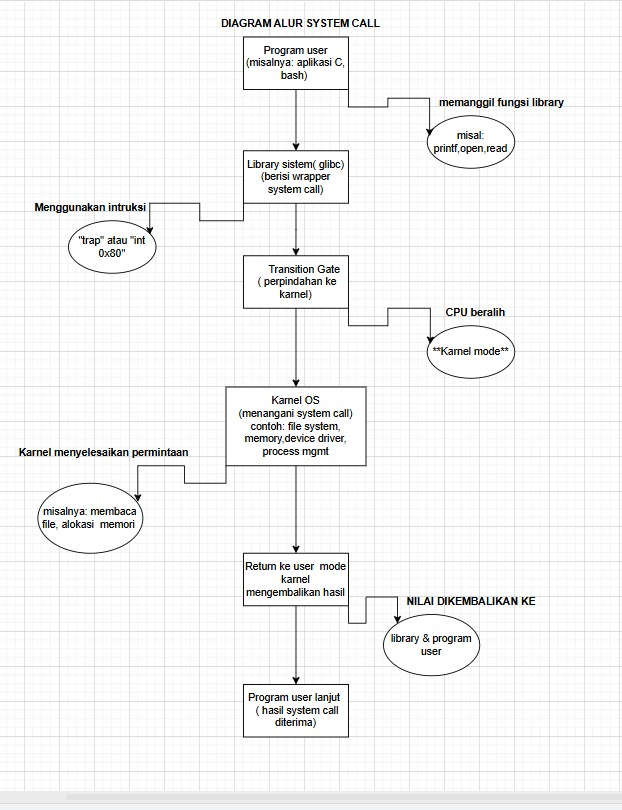
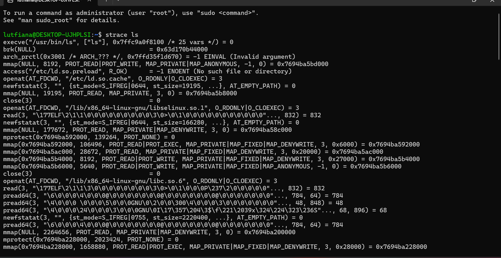
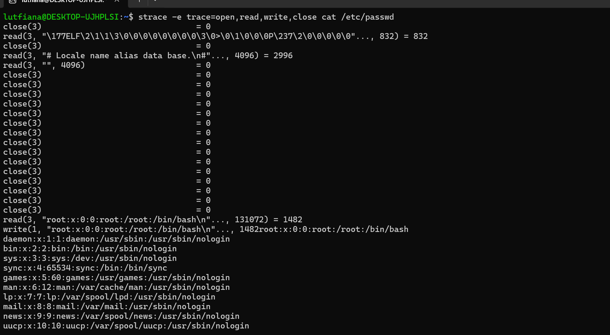
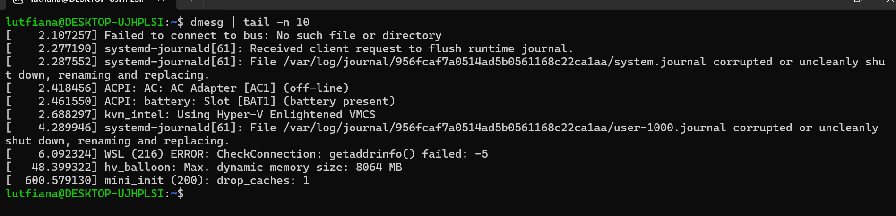

# Laporan Praktikum Minggu [2]
Topik: [ Struktur System Call dan Fungsi Kernel ]

---

## Identitas
- **Nama**  : [Asyifani Lutfiana Nadzif]  
- **NIM**   : [250202931]  
- **Kelas** : [1ikrb]

---

## Tujuan
Tuliskan tujuan praktikum minggu ini: 
>- Menjelaskan konsep dan fungsi system call dalam sistem operasi.
>- Mengidentifikasi jenis-jenis system call dan fungsinya.
>- Mengamati alur perpindahan mode user ke kernel saat system call terjadi.
>- Menggunakan perintah Linux untuk menampilkan dan menganalisis system call.

---

## Dasar Teori
>- System Call (Gerbang Akses Kernel)
System Call adalah mekanisme yang disediakan oleh sistem operasi untuk memungkinkan program aplikasi (User Mode) meminta layanan dari Kernel (Kernel Mode).
Program aplikasi (seperti browser atau text editor) tidak dapat secara langsung mengakses hardware atau sumber daya kritis sistem (seperti membuka berkas di hard disk atau membuat proses baru) karena alasan keamanan dan stabilitas. System Call adalah satu-satunya gerbang resmi untuk melakukan hal tersebut.
>- Kernel adalah inti (core) dari sistem operasi. Dia adalah perangkat lunak pertama yang dimuat saat komputer dinyalakan, dan dia tetap berada di memori utama (RAM) selama komputer berjalan. Kernel berfungsi sebagai jembatan utama antara software aplikasi dengan hardware komputer.

---

## Langkah Praktikum
1. Mendownload aplikasi Ubuntu/Wsl untuk menjalankan linux. 
2. perintah yang di jalankan yaitu meliputi  strace ls,strace -e trace=open,read,write,close cat /etc/passwd, dan dmesg | tail -n 10
4. membuat diagram dan hasil observasi dari linux yang di jalankan
5. lalu screenshot hasil linux   
6. setelahnya masukan dalam laporan. md 
7. push github untuk hasil screenshot dan laporannya.

---

## Kode / Perintah
Tuliskan potongan kode atau perintah utama:
```bash
strace ls
strace -e trace=open,read,write,close cat /etc/passwd
dmesg | tail -n 10
```

---

## Hasil Eksekusi
Sertakan screenshot hasil percobaan atau diagram:





**Table Observasi strace ls**
| System Call | Keterangan |
| :--- | :--- | 
|  **execve** | Menjalankan pemrograman baru.  |  
| **brk**    | Mengatur ruang memori proses. |
|**mmap** | Memetakan file ke memori.|
| **openat** | membuka file/ direktori.|
| **write** | Menulis output ke terminal.|

**Table Observasi strace -e trace=open,read,write,close cat /etc/passwd**

|System call | Keterangan|
| :---| :---|
| **Open**| Membuka file/etc/passwd.|
| **read**| Membaca isi fille.|
|**write**| Menampilkan Ke layar.||
|**close**| menutup file setelah digunakan.|

**Table Observasi dmesg | tail -n 10**

|  System call    |     Keterangan |
| :---| :---|
| **dmesg** | menampilkan log aktivitas karnel, termasuk driver, boot, dan system call yang tercatat  di karnel ring buffer.
| **tail -n 10** | menampilkan  10 pesan terakhir dari log karnel.|
---

## Analisis
-  salah satu Hasil percobaan:
```
lutfiana@DESKTOP-UJHPLSI:~$ dmesg | tail -n 10
[    2.107257] Failed to connect to bus: No such file or directory
[    2.277190] systemd-journald[61]: Received client request to flush runtime journal.
[    2.287552] systemd-journald[61]: File /var/log/journal/956fcaf7a0514ad5b0561168c22ca1aa/system.journal corrupted or uncleanly shut down, renaming and replacing.
[    2.418456] ACPI: AC: AC Adapter [AC1] (off-line)
[    2.461550] ACPI: battery: Slot [BAT1] (battery present)
[    2.688297] kvm_intel: Using Hyper-V Enlightened VMCS
[    4.289946] systemd-journald[61]: File /var/log/journal/956fcaf7a0514ad5b0561168c22ca1aa/user-1000.journal corrupted or uncleanly shut down, renaming and replacing.
[    6.092324] WSL (216) ERROR: CheckConnection: getaddrinfo() failed: -5
[   48.399322] hv_balloon: Max. dynamic memory size: 8064 MB
[  600.579130] mini_init (200): drop_caches: 1
```
- penjelasan tentang linux yang dijalankan yaitu:
  - 1. strace ls
  -  strace = singkatan dari system trace.
Ini adalah alat (tool) di Linux yang digunakan untuk memantau dan menampilkan semua system call yang dilakukan oleh suatu program saat dijalankan.
ls = perintah Linux untuk menampilkan daftar file dan folder dalam direktori saat ini.
Jadi, strace ls berarti:
 “Jalankan program ls, sambil menampilkan semua system call yang digunakan oleh program tersebut untuk berinteraksi dengan kernel.”
- 2. strace -e trace=open,read,write,close cat /etc/passwd
- strace	Alat (tool) untuk melacak dan menampilkan system call yang dilakukan oleh suatu program.
-e trace=open,read,write,close	Opsi -e digunakan untuk memfilter output agar hanya menampilkan system call tertentu. Dalam hal ini, hanya system call open, read, write, dan close yang akan ditampilkan.
cat /etc/passwd	Perintah cat digunakan untuk membaca dan menampilkan isi file /etc/passwd, yaitu file yang berisi daftar akun pengguna di sistem Linux.
- 3. dmesg | tail -n 10
- Perintah dmesg | tail -n 10 digunakan untuk: Melihat 10 pesan kernel terbaru, agar kita bisa memantau apa yang sedang dilakukan kernel, terutama yang berkaitan dengan hardware, driver, atau error sistem.
  >- System call (panggilan sistem) merupakan mekanisme fundamental yang sangat penting untuk keamanan sistem operasi (OS). System call adalah antarmuka yang memungkinkan program di ruang user (tingkat hak akses rendah) untuk meminta layanan dari OS yang berjalan di ruang kernel (tingkat hak akses tertinggi). Layanan ini mencakup operasi kritis seperti I/O perangkat keras, manajemen memori, dan kontrol proses.

Peran System Call dalam Keamanan OS
Pentingnya system call untuk keamanan terletak pada peran mereka sebagai gerbang yang dijaga ketat menuju sumber daya inti sistem. Karena kode kernel memiliki akses penuh ke perangkat keras dan semua memori, ia harus dilindungi dari program pengguna yang mungkin rusak atau berniat jahat.
Tanpa system call, program pengguna akan memerlukan akses langsung ke sumber daya tersebut. Hal ini akan:
> 1. Mengorbankan Isolasi: Memungkinkan satu program yang salah berfungsi atau berbahaya merusak data atau kode program lain, atau bahkan seluruh OS.
> 2. Melanggar Integritas Sistem: Jika program pengguna dapat langsung memanipulasi perangkat keras atau tabel memori, integritas dan stabilitas OS akan terancam.
- System call menerapkan prinsip hak akses terkecil (principle of least privilege). Program pengguna hanya diberikan akses ke sumber daya yang dibutuhkan, dan akses ini dimediasi dan divalidasi oleh kernel. Kernel bertindak sebagai otoritas yang memvalidasi setiap permintaan, memastikan bahwa:
> 1. Program memiliki izin yang diperlukan (misalnya, izin file) untuk operasi yang diminta.
> 2. Parameter permintaan valid dan tidak akan menyebabkan kerusakan atau kerentanan (misalnya, buffer overflow).
> 3. Transisi kembali ke ruang user dilakukan dengan aman.
- Dengan mengendalikan semua akses sensitif, system call menjaga isolasi antara proses dan memastikan integritas sistem secara keseluruhan.

**Keamanan Transisi User–Kernel**
> Transisi antara ruang user dan ruang kernel adalah momen kritis yang harus ditangani dengan sangat aman oleh OS untuk mencegah eksploitasi. OS memastikan transisi berjalan aman melalui mekanisme perangkat keras dan perangkat lunak:
> 1. Mode Dual (Dual-Mode Operation): CPU beroperasi dalam dua mode—mode user (hak akses terbatas) dan mode kernel/supervisor (hak akses penuh). System call adalah satu-satunya cara sah bagi program user untuk memicu perubahan mode ini.
> 2. Instruksi Khusus (Trap/Interrupt Mechanism): System call dipicu oleh instruksi khusus (seperti syscall atau int 0x80 di x86) yang menyebabkan trap ke kernel. Trap ini secara otomatis:
>- Mengubah mode CPU dari user ke kernel.
>- Menyimpan konteks CPU (register, program counter program user).
>- Mengarahkan eksekusi ke fungsi penangan system call di kernel, yang jalurnya sudah ditentukan dan diverifikasi oleh OS.
> 3. Validasi Parameter (Parameter Validation): Setelah berada di kernel, fungsi penangan system call memverifikasi semua argumen yang diteruskan dari ruang user. Kernel harus hati-hati memeriksa pointer untuk memastikan bahwa mereka merujuk ke memori yang dapat diakses oleh program user (misalnya, untuk mencegah kernel membaca data sensitif dari memori kernel itu sendiri atau dari program lain).
> 4. Akses Terbatas: Program kernel yang menangani system call dijalankan dengan hak akses penuh, tetapi operasinya terbatas pada implementasi fungsi system call yang telah teruji dan aman. Setelah selesai, OS akan:
>- Memulihkan konteks program user yang tersimpan.
>- Mengubah mode CPU kembali ke mode user.
>- Melanjutkan eksekusi program user.

Mekanisme yang ketat ini mencegah kode pengguna untuk secara langsung melompat atau mengeksekusi instruksi di ruang kernel secara sembarangan, yang merupakan dasar dari banyak serangan eksploitasi kernel.

Contoh System Call yang Sering Digunakan di Linux
Beberapa system call Linux yang paling umum digunakan meliputi:

>- read(): Membaca data dari deskriptor file (misalnya, file, socket, atau pipe).
>- write(): Menulis data ke deskriptor file.
>- open() / openat(): Membuka file atau perangkat dan mengembalikan deskriptor file. Ini melibatkan pemeriksaan izin file.
>- close(): Menutup deskriptor file.
>- fork(): Membuat proses baru (proses anak) dengan menduplikasi proses yang memanggil.
>- execve(): Mengganti gambar proses yang sedang berjalan dengan program baru.
>- exit(): Mengakhiri proses yang sedang berjalan.
>- mmap(): Memetakan file atau objek ke dalam memori proses.
>-  kill(): Mengirim sinyal ke suatu proses.

  


---

## Kesimpulan
 Melalui serangkaian eksperimen menggunakan perintah strace dan dmesg, saya dapat memahami secara langsung bagaimana system call bekerja sebagai penghubung antara program user (user mode) dengan kernel (kernel mode) dalam sistem operasi Linux.
   

---

## Quiz
1. [ Apa fungsi  utama system call dalam sistem oprasi? ]  
   **Jawaban:** 
   Fungsi utama system call adalah sebagai jembatan antara program aplikasi (user mode) dengan kernel (kernel mode). System call memungkinkan program untuk meminta layanan dari sistem operasi seperti membaca/menulis file, membuat proses, mengalokasikan memori, dan berkomunikasi dengan perangkat keras. Tanpa system call, aplikasi tidak bisa mengakses sumber daya sistem secara langsung dan aman
2. [Sebutkan 4 kategori system call yang umum digunakan.]  
   **Jawaban:** 
>-  File Management → untuk operasi file seperti open, read, write, close.
>-  Process Control → untuk mengatur proses seperti fork, execve, exit, wait.
>- Device Management → untuk komunikasi dengan perangkat seperti ioctl, read, write.
>- Information Maintenance / Communication → untuk pertukaran data antarproses dan pengambilan informasi sistem seperti getpid, pipe, signal, shmget.
3.  [Mengapa system call tidak bisa dipanggil langsung oleh user program ]  
   **Jawaban:**  
System call tidak bisa dipanggil langsung oleh user program karena beroperasi di mode kernel, sedangkan program pengguna berjalan di mode user. Pemisahan ini penting untuk keamanan dan stabilitas sistem. Jika user program bisa langsung mengakses kernel, maka bisa terjadi kesalahan fatal atau penyalahgunaan sumber daya sistem. Oleh karena itu, sistem operasi menyediakan interface khusus (API) yang memanggil system call melalui mekanisme interrupt atau trap yang aman untuk berpindah dari user mode ke kernel mode.
---

## Refleksi Diri
Tuliskan secara singkat:
- Apa bagian yang paling menantang minggu ini? 
- Dalam mendownload ubuntu  
- Bagaimana cara Anda mengatasinya?  
- minta ajarin teman 
- melihat tutorial

---

**Credit:**  
_Template laporan praktikum Sistem Operasi (SO-202501) – Universitas Putra Bangsa_
