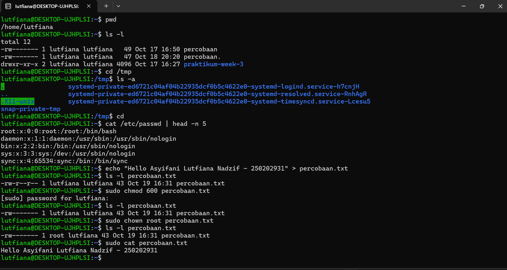

# Laporan Praktikum Minggu [3]
Topik: [Manajemen File dan Permission di Linux]

---

## Identitas
- **Nama**  : [Asyifani Lutfiana Nadzif]  
- **NIM**   : [250202931]  
- **Kelas** : [1ikrb]

---

## Tujuan
Tuliskan tujuan praktikum minggu ini: 
1.  Menggunakan perintah ls, pwd, cd, cat untuk navigasi file dan direktori.
2. Menggunakan chmod dan chown untuk manajemen hak akses file.
3. Menjelaskan hasil output dari perintah Linux dasar.

---

## Dasar Teori
Manajemen file dan permission di Linux berfungsi untuk mengatur cara penyimpanan, akses, serta keamanan file di dalam sistem. Dengan adanya sistem izin (read, write, execute) yang diterapkan untuk setiap pengguna, Linux mampu menjaga integritas dan keamanan data antar user dalam lingkungan multi-user.
 > **Permission(Hak Akses File)**
 - Read (r) yaitu boleh membaca isi file
 - Write(w) yaitu boleh mengubah isi file
 - Execute (x) yaitu boleh menjalankan file(jika executable)
> Tujuan Manajemen File dan permission:
1. Menjamin keamanan data antar pengguna.
2. Menghindari akses ilegal terhadap file penting sistem.
3. Memungkinkan pembagian sumber daya secara efisien.
4. Menjaga integritas sistem operasi agar stabil.

---

## Langkah Praktikum
1. Persiapkan Aplikasi Linux (Ubuntu/WSL)
2. Melakukan **Eksperimen 1** untuk melihat dan menavigasi sistem file menggunakan  ``pwd``, ``ls -l``, ``cd /tmp ``, ``ls -a``
3. Melakukan **Eksperimen 2** berfungsi untuk membaca file dan hanya menampilkan lima baris pertama ``cat ``/``etc``/``passwd`` | ``head -n 5``  
4. Melakukan **Eksperimen 3** untuk memanipulasi izin dan kepemilikan file menggunakan `` echo``, ``chmod``, dan ``sudo chown``
5. Screenshot  dari hasil eksperimen  1 sampai 3 dan disimpan di folder ``screenshot/.``
6. Mendokumentasikan seluruh hasil dan analisis dalam file ``laporan.md``
7. Lalu ``push`` hasil praktikum di Github dengan pesan commit yang sesuai.

---

## Kode / Perintah
Eksprimen 1
```
pwd
ls -l
cd /tmp
ls -a
```

Eksperimen 2
```
cat /etc/passwd | head -n 5
```

Eksperimen 3 
```
cd
echo "Hello <NAME><NIM>" > percobaan.txt
ls -l percobaan.txt
chmod 600 percobaan.txt
ls -l percobaan.txt
sudo chown root percobaan.txt
ls -l percobaan.txt
```

---

## Hasil Eksekusi
Sertakan screenshot hasil percobaan atau diagram:


# Eksperimen 1 pwd,ls -l,cd /tmp,ls -a
| Perintah | Hasil Output | Keterangan |
|:---|:---|:---|
|``pwd``| ``/home/lutfiana`` |untuk menampilkan jalur lengkapdari direktori kerja saat ini|
|``ls -l``| ``drwxr-xr-x 2 lutfiana 4096 Oct 17 16:27 praktikum-week-3``| yaitu tampilan daftar panjang dari file dan direktori di direktori kerja saat ini.|
| ``cd/tmp`` | Tidak ada output | digunakan untuk mengubah deriktori aktif.|
| ``ls -a``| menampilkan file ``systemd-private...,unix,dll``|berfungsi untuk mendaftar semua file dan direktori di direktori kerja saat ini, termasuk yang tersembunyi.|

# Eksperimen 2 cat /etc/passwd | head -n 5
|Perintah | Keterangan|
|:---|:---|
|``cd``| mengembalikan direktori ke awal|
|cat| perintah yang digunakan untuk membaca isi file dan menampilkannya ke output standar.|
|``/etc/passwd``|file konfigurasi sistem penting yang berisi informasi tentang semua akun|
| `` head -n 5``| menampilkan baris awal (head) dari input yang diterimanya dan menentukan bahwa hanya 5 baris pertama yang harus ditampilkan.

# Eksperimen 3 

`` echo "Hello Asyifani Lutfiana Nadzif - 250202931" > percobaan.txt``
- perintah ini berfungsi untuk membuat file baru menuliskan string teks di dalamnya.
  
``ls -l percobaan.txt``
|Kode permission | Keterangan|
|:---|:---|
|``rw-``|  memiliki izin baca dan tulis|
|``rw--``|izin baca|

``chmod 600 percobaan.txt``
- Perintah ini digunakan untuk mengubah hak akses menggunakan notasi numerik.
  
``ls -l percobaan.txt``
|Kode permission | Keterangan |
|:---|:---|
|``rw-``| memiliki izin baca dan tulis|
|``---``| tidak memiliki izin|


``sudo chown root percobaan.txt``
- Perintah ini digunakan untuk mengubah kepemilikan
  
``ls -l percobaan.txt``
- Perintah ini menampilkan detail lengkap (long listing format) dari file untuk memverifikasi perubahan.

---

## Analisis
# Eksperimen 1 navigasi sistem file
- pwd → menunjukkan lokasi direktori aktif saat ini.
- ls -l → menampilkan daftar file dengan detail (izin akses, pemilik, ukuran, waktu).
- cd /tmp → berpindah ke direktori /tmp.
- ls -a → menampilkan semua file termasuk file tersembunyi.
# Eksperimen 2 Membaca file sistem 
Menampilkan 5 baris pertama dari file`` /etc/passwd``
# Eksperimen 3 permission & ownership
- ``echo`` → membuat file berisi teks.
- ``chmod 600`` → memberikan permission hanya untuk pemilik yg berisi:
``rw- ``(read & write) untuk owner.
``--- ``(no access) untuk group dan oth.
- kemudian melakukan uji akses file (jika memiliki sudo):
``sudo chown root percobaan.txt``
``ls -l percobaan.txt``
yang artinya menunjukan perubahan kepemilikan.
- Analisis dari (rwxr-xr--).
  >- ``rwx`` yaitu Izin untuk pengguna yang membuat atau memiliki file/direktori.
  >- ``r-x`` yaitu Izin untuk anggota grup yang terkait dengan file/direktori.
  >- ``r--`` yaitu zin untuk semua pengguna lain di sistem yang bukan Pemilik dan bukan anggota Grup.
  - Analisis peran chmod dan chown dalam keamanan sistem Linux.
  >- Perintah chmod dan chown adalah dua alat yang mengelola keamanan sistem Linux karena keduanya mengontrol izin dan kepemilikan file, yang merupakan garis pertahanan pertama melawan akses tidak sah.


---

## Kesimpulan
1. Manajemen file dan permission di Linux merupakan hal penting untuk menjaga keamanan dan keteraturan sistem. Dengan memahami struktur file serta hak akses, pengguna dapat mengontrol siapa yang dapat membaca, menulis, atau mengeksekusi file.
2. Perintah dasar seperti ``pwd``,`` ls``, dan ``cd`` digunakan untuk melakukan navigasi di dalam sistem file Linux, sedangkan cat digunakan untuk membaca isi file seperti /etc/passwd yang berisi data akun pengguna.
3. Perintah chmod berfungsi untuk mengubah izin akses file (read, write, execute) bagi pengguna, grup, dan lainnya. Sementara itu, chown digunakan untuk mengubah kepemilikan file atau direktori.


---

## Quiz
1. [Apa fungsi dari perintah ``chmod``?]  
   **Jawaban:** 
   - perintah ``chmod`` digunkan untuk mengubah izin akses suatu file atau direktori disistem linux.

2. [Apa arti dari kode permission ``rwxr-xr--``?]
   **Jawaban:**  
   |Kode permission | Keterangan|
   |:---| :---|
   |``rwx`` | pemilik dapat membaca(r), menulis (w),dan mengeksekusi(x).|
   |``r-x``| dapat membaca (r)dan mengeksekusi(x),tetapi tidak bisa menulis|
   | ``r--``|hanya dapat membaca saja.||

3. [Jelaskan perbedaan antara ``chown`` dan ``chmod``.]  
   **Jawaban:**  
- ``chown`` change owner mengubah kepemilikan file (Owner dan Group).
- ``chmod`` (change mode) mengubah izin akses file atau direktori (permissions: baca, tulis, eksekusi).
---

## Refleksi Diri
Tuliskan secara singkat:
- Apa bagian yang paling menantang minggu ini?  
  >- dalam menjalankan linux untuk beberapa kali dalam perubahan file
- Bagaimana cara Anda mengatasinya?  
  >- mencari tau di internet dan juga tanya ke teman

---

**Credit:**  
_Template laporan praktikum Sistem Operasi (SO-202501) – Universitas Putra Bangsa_
