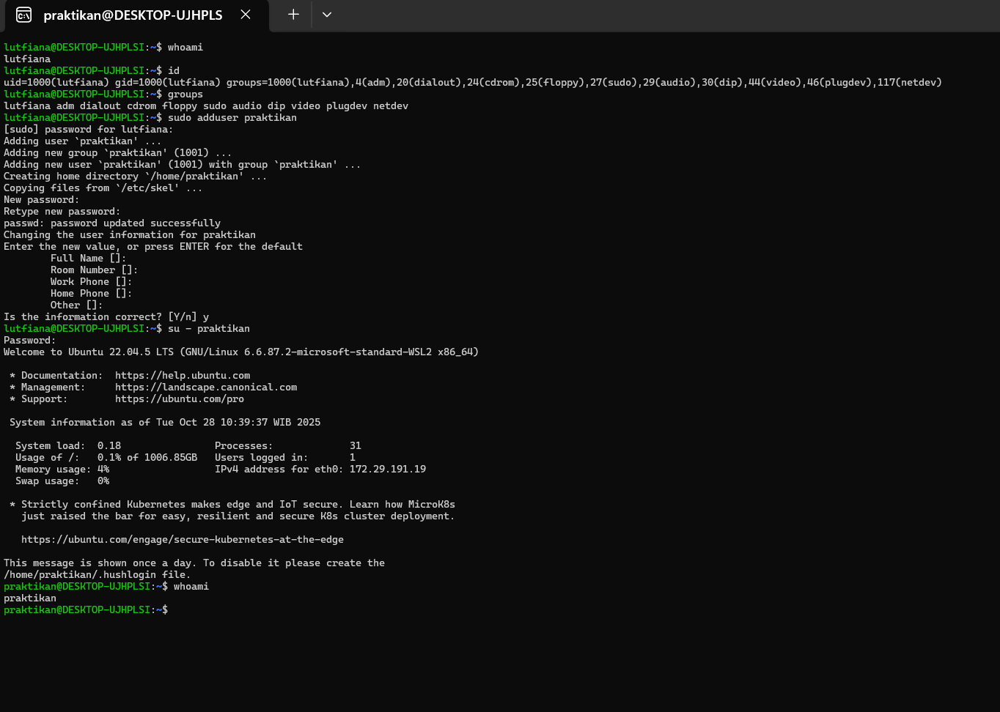
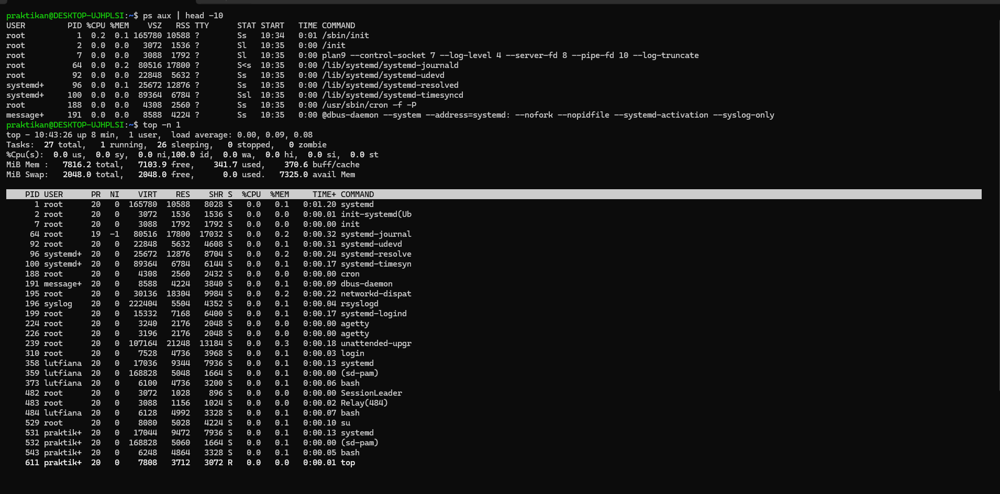
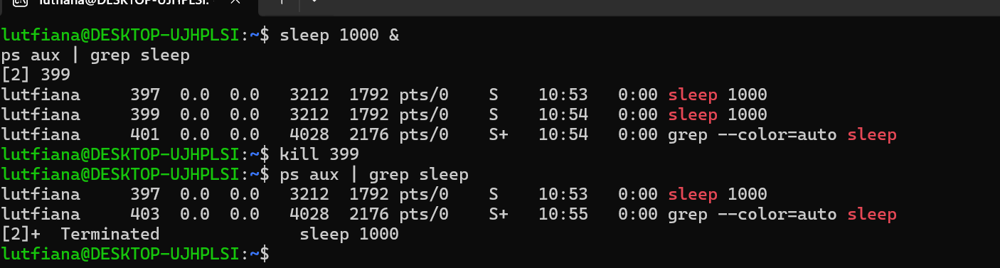
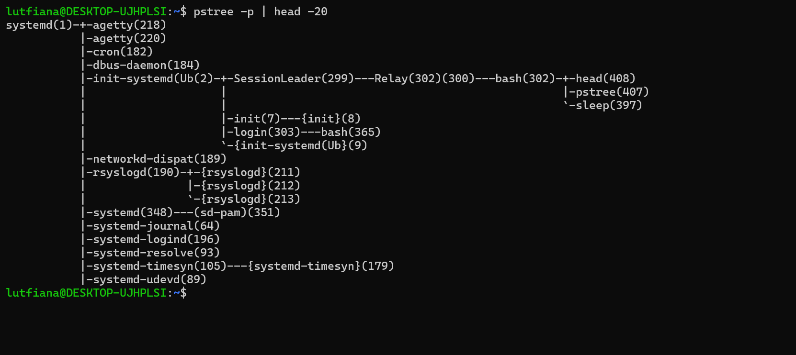

# Laporan Praktikum Minggu [4]
Topik: [Manajemen Proses dan User di Linux]

---

## Identitas
- **Nama**  : [Ayifani Lutfiana Nadzif]  
- **NIM**   : [250202931]  
- **Kelas** : [1ikrb]

---

## Tujuan
Tuliskan tujuan praktikum minggu ini.  
Contoh:  
1. Menjelaskan konsep proses dan user dalam sistem operasi Linux.
2. Menampilkan daftar proses yang sedang berjalan dan statusnya.
3. Menggunakan perintah untuk membuat dan mengelola user.
4. Menghentikan atau mengontrol proses tertentu menggunakan PID.
5. Menjelaskan kaitan antara manajemen user dan keamanan sistem.

---

## Dasar Teori
Manajemen Proses dan Manajemen Pengguna (User) di Linux merupakan konsep fundamental dalam sistem operasi.
- Manajemen proses linux adalah tugas sistem operasi untuk mengalokasikan sumber daya ke proses dan memungkinkan proses untuk berbagi dan bertukar informasi.PID (Process ID)yaitu Nomor identifikasi unik yang diberikan oleh kernel ke setiap proses.
- Manajemen pengguna adalah cara sistem operasi mengontrol akses ke sumber daya dan memberikan otorisasi.Setiap user memiliki ID Pengguna (UID) yang unik dan juga Setiap group memiliki ID Grup (GID)

---

## Langkah Praktikum
1. Siapkan Ubuntu/WSL
2. Melakukan  Eksperimen 1 mengidentifikasi user ``whoami``,``id``,``groups``. lalu screenshot hasil linux.
3. Melakukan Eksperimen 2 jalankan monitoring dari ``ps aux | head -10``,
``top -n 1`` lalu screenshot hasil linux.
4. Melakukan Eksperimen 3  menjalankan kontrol proses dari ``sleep 1000 &``
``ps aux | grep sleep``,`` kill <PID>`` lalu screenshot hasil linux.
5. Melakukan Eksperimen 4 jalankan analisis hierarki proses dari ``pstree -p | head -20`` lalu screenshot hasil linux
6. Mendokumentasikan  seluruh hasil dan analisis dalam file ``laporan.md``
7. Lalu push  hasil Praktikum ke Github dengan pesan commit yang sesuai.

---

## Kode / Perintah
 # Eksperimen 1
```bash
whoami
id
groups
sudo adduser praktikan
sudo passwd praktikan
```

# Eksperimen 2 
```bash
ps aux | head -10
top -n 1
```
# Eksperimen 3
``` bash 
sleep 1000 &
ps aux | grep sleep
kill <PID>
```
# Eksperimen 4
```bash
pstree -p | head -20

```


## Hasil Eksekusi
Sertakan screenshot hasil percobaan atau diagram:





# Eksperimen 1 identitas user
| Perintah| Keterangan|
|:---|:---|
|``Whoami``| menampilkan user name pengguna yang sedang  digunakan saat ini untuk menjalankan perintah tersebut.|
|`` id``| menampilkan informasi identitas user saat ini.|
|``groups``|menampilkan daftar semua grup tempat user  menjadi anggota.|
|``sudo adduser praktikan``|membuat akun pengguna (user) baru dengan nama username praktikan.|
|``su - praktikan``| berganti user dari awal lutfiana menjadi praktikan|

# Eksperimen 2  Monitoring proses
Penjelasan ``ps aux`` dan ``top``
| Kolom | Keterangan|
|:---|:---|
|``PID ``| Process ID (Nomor identifikasi unik).|
|``%CPU`` / ``%MEM``| Persentase penggunaan CPU dan Memori.|
|``STAT``|  Status proses (misalnya, S = Tidur/Sleeping, R = Berjalan/Running).|
|``COMMAND``| Perintah yang digunakan untuk menjalankan proses.|

# Eksperimen 3 kontrol proses
1. ``sleep 1000``: Perintah ini memulai proses yang akan tidur(menganggur) selama 1000 detik.simbol (``&``) Simbol ini mengirimkan proses output PID,yaitu 399
2. ``ps aux`` Mencantumkan semua proses yang berjalan di sistem (snapshot statis).
``| grep sleep``: Meneruskan daftar proses tersebut ke perintah grep untuk memfilter dan hanya menampilkan baris yang mengandung kata "sleep".
3. ``kill`` Mengirim sinyal terminasi ke suatu proses.
``<123>``Ini adalah tempat user harus mengganti dengan PID proses sleep user, misalnya 12345.
4. cek kembali ``ps aux | grep sleep ``digunakan untuk memverifikasi apakah proses sleep yang sebelumnya mulai masih berjalan di sistem.Jika proses telah berhenti, hasil dari perintah ini akan menunjukkan hanya satu baris, yaitu baris untuk perintah ``grep`` itu sendiri.

# Eksperimen 4 Hierarki Proses
Perintah ``pstree -p | head -20 ``secara keseluruhan digunakan untuk melihat 20 baris teratas dari hierarki proses sistem, lengkap dengan ID Proses (PID), yang berguna untuk memahami bagaimana proses-proses utama (seperti boot sistem dan daemon dasar) saling terkait.


---

## Analisis
Hubungan antara manajemen pengguna (user management) dan keamanan sistem Linux sangatlah erat dan fundamental. Manajemen pengguna adalah dasar dari hampir semua kebijakan dan praktik keamanan pada sistem Linux. Setiap pengguna memiliki identitas unik (UID/username) dan keanggotaan grup (GID). Sistem menggunakan identitas ini untuk menerapkan izin berkas (permissions) (UGO: User, Group, Other), memastikan pengguna hanya dapat mengakses berkas dan direktori yang mereka butuhkan. 

---

## Kesimpulan
1. struktur dan kontrol Linux berjalan sebagai proses yang diidentifikasi oleh PID. Perintah seperti ``ps aux`` dan ``top`` menyediakan snapshot statis dan dinamis tentang konsumsi sumber daya (``%CPU``, ``%MEM``) oleh proses.
2. pengendalian menguasai cara mengontrol siklus hidup proses, termasuk menjalankannya di latar belakang (``sleep 1000 &``) dan menghentikannya secara paksa atau graceful (``kill <PID>``).

---

## Quiz
1. Apa fungsi dari proses ``init`` atau ``systemd`` dalam sistem Linux?
    
   **Jawaban:** 

  -  Fungsi dari proses`` init`` (atau penerusnya, ``systemd``, yang merupakan standar modern) adalah menjadi proses pertama yang dijalankan di sistem Linux dengan PID 1. 

2. Apa perbedaan antara ``kill`` dan ``killall``?  

   **Jawaban:**  
   - ``kill`` menargetkan proses berdasarkan PID.cara yang sangat spesifik dan terkontrol untuk mengelola proses. Sintaks: ``kill <PID>``
   - ``killall`` menargetkan proses berdasarkan nama perintah yang digunakan untuk memulainya. Ini adalah cara cepat untuk menghentikan semua instance dari sebuah program.Sintaks: ``killall <nama_perintah>``

3.  Mengapa user root memiliki hak istimewa di sistem Linux?
    
   **Jawaban:**  
- User ``root`` memiliki hak istimewa di sistem Linux karena  akun superuser yang dirancang untuk memiliki kontrol mutlak dan tanpa batas atas seluruh sistem operasi. yaitu seperti:Kontrol Penuh terhadap Kernel dan Perangkat Keras,Mengabaikan Izin Berkas,Tugas Administrasi dan Pemeliharaan,Perlindungan Sistem
 

---

## Refleksi Diri
Tuliskan secara singkat:
- Apa bagian yang paling menantang minggu ini?  
  Dalam menjalankan eksperimen 1
- Bagaimana cara Anda mengatasinya?  

---

**Credit:**  
_Template laporan praktikum Sistem Operasi (SO-202501) – Universitas Putra Bangsa_
