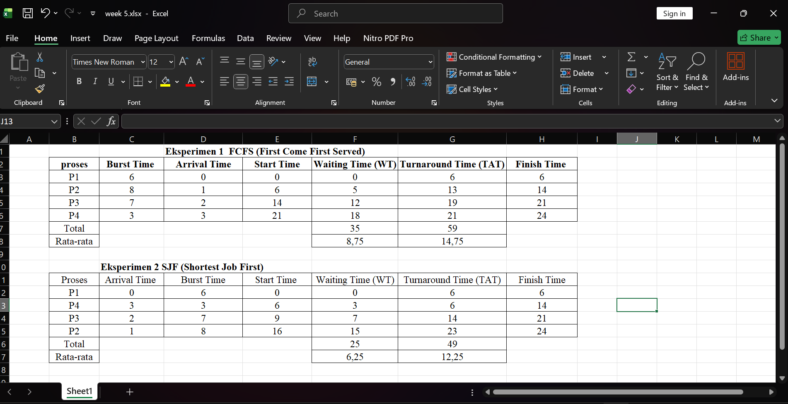
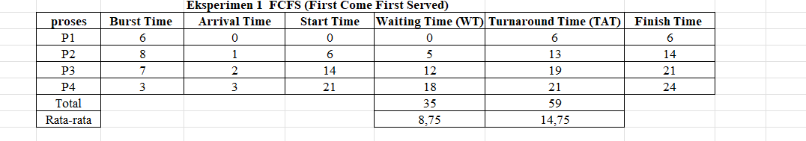
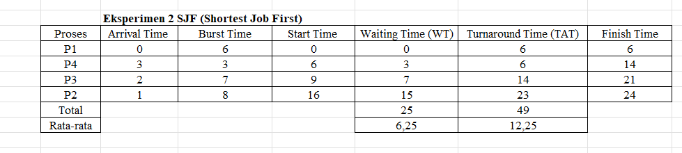

# Laporan Praktikum Minggu [5]
Topik: [Penjadwalan CPU – FCFS dan SJF]

---

## Identitas
- **Nama**  : [Asyifani Lutfiana Nadzif]  
- **NIM**   : [250202931]  
- **Kelas** : [1IKRB]

---

## Tujuan
1. Menghitung waiting time dan turnaround time untuk algoritma FCFS dan SJF.
2. Menyajikan hasil perhitungan dalam tabel yang rapi dan mudah dibaca.
3. Membandingkan performa FCFS dan SJF berdasarkan hasil analisis.
4. Menjelaskan kelebihan dan kekurangan masing-masing algoritma.
5. Menyimpulkan kapan algoritma FCFS atau SJF lebih sesuai digunakan.

---

## Dasar Teori
CPU adalah proses fundamental dalam sistem operasi multiprogramming. Tujuannya adalah untuk menentukan proses mana di dalam antrian siap yang akan mendapatkan alokasi CPU ketika CPU sedang tidak terpakai.
- FCFS adalah algoritma penjadwalan CPU yang paling sederhana.proses yang pertama kali meminta CPU akan menjadi yang pertama kali dilayani dan dialokasikan CPU.
- SJF adalah algoritma yang dirancang untuk mengatasi kelemahan convoy effect pada FCFS. Algoritma ini melihat ke dalam ready queue dan memilih proses yang memiliki estimasi CPU burst time  terpendek untuk dijalankan terlebih dahulu.

---

## Langkah Praktikum
1. Mempersiapkan data proses dengan Burst Time dan Arrival Time yang ditentukan.
2. Menyiapkan Google sheets/excel atau alat hitung.
3. Melakukan Eksperimen 1 untuk menghitung Waiting Time(WT)dan Turnaround Time(TAT) menggunakan FCFS.
4. Membuat Gantt Chart sederhana untuk FCFS.
5. Melakukan Eksperimen 2 untuk menghitung Waiting Time (WT) dan Turnaround Time menggunakan SJF.
6. Membuat Table perbandingan untuk Avarage WT dan TAT dari FCFS dan SJF.
7. Mendokumentasikan hasil eksperimen.
8. Lakukan push hasil praktikum ke GitHub.

---

## Kode / Perintah
Tuliskan potongan kode atau perintah utama:
```bash
Waiting Time (WT) = waktu mulai eksekusi - Arrival Time
Turnaround Time (TAT) = WT + Burst Time
```

---

## Hasil Eksekusi
Sertakan screenshot hasil percobaan atau diagram:


## Eksperimen 1 FCFS (First Come First Served)

- Gantt Chart sederhana
```Bash 
| P1 | P2 | P3 | P4 |
0    6    14   21   24
 ```

## Eksperimen 2 SJF(Shortest Job First)

- Gantt Chart sederhana
```bash
| P1 | P2 | P3 | P4 |
0    6    9   16    24
```
## Perbandingan hasil FCFS & SJF
| Algoritma | Avg Waiting Time | Avg Turnaround Time | Kelebihan | Kekurangan |
|------------|------------------|----------------------|------------|-------------|
| FCFS | 8,75 | 14,75 | Sederhana dan mudah diterapkan | Tidak efisien untuk proses panjang |
| SJF | 6,25 | 12,25 | Optimal untuk job pendek | Menyebabkan *starvation* pada job panjang |

---


## Analisis
1. Perbandingan hasil rata-rata WT dan TAT antara FCFS & SJF.
   - Rata-rata Waiting Time (WT): Algoritma SJF (``6,25``) memiliki rata-rata waktu tunggu yang lebih cepat dibandingkan FCFS (``8,75``).
   - Rata-rata Turnaround Time (TAT): Algoritma SJF (``12,25``) juga memiliki rata-rata waktu penyelesaian total yang lebih cepat dibandingkan FCFS (``14,75``).
2. kondisi kapan SJF lebih unggul dari FCFS dan sebaliknya.
   - SJF lebih unggul dari FCFS hampir selalu lebih unggul dalam hal efisiensi (rata-rata WT dan TAT yang cepat).
   - FCFS lebih unggul dari SJF yaitu memiliki keunggulan yang membuatnya lebih sering digunakan dalam konteks tertentu seperti Kesederhanaan dan Overhead Rendah,Tidak Ada Risiko Starvation,Keadilan (Fairness).
   

---

## Kesimpulan
- SJF (Shortest Job First) menunjukkan kinerja yang lebih unggul (optimal) dibandingkan FCFS.
- Keunggulan SJF ini didapatkan karena SJF berhasil meminimalkan waktu tunggu dengan mendahulukan proses-proses yang memiliki burst time pendek, sehingga menghindari Convoy Effect yang terlihat pada FCFS.

---

## Quiz
1. Apa perbedaan utama antara FCFS dan SJF? 
   **Jawaban:**  
- Perbedaan utama antara FCFS (First Come First Served) dan SJF (Shortest Job First) terletak pada kriteria penentuan proses mana yang akan dieksekusi selanjutnya dan dampaknya terhadap kinerja sistem.
  
2. Mengapa SJF dapat menghasilkan rata-rata waktu tunggu minimum? 
   **Jawaban:**  
- SJF (Shortest Job First) dapat menghasilkan rata-rata waktu tunggu (Waiting Time/WT) minimum karena menggunakan strategi penjadwalan yang paling efisien dalam mengelola antrian proses.
  
3. Apa kelemahan SJF jika diterapkan pada sistem interaktif?
   **Jawaban:**  
- Kelemahan utama dari algoritma penjadwalan SJF (Shortest Job First) jika diterapkan pada sistem interaktif yaitu respons time yang buruk,Starvation (Kelaparan).

---

## Refleksi Diri
Tuliskan secara singkat:
- Apa bagian yang paling menantang minggu ini? mungkin dalam melakukan perhitungan tetapi sedikit paham dengan FCFS & SJF
- Bagaimana cara Anda mengatasinya? Menggunakan aplikasi bantu

---

**Credit:**  
_Template laporan praktikum Sistem Operasi (SO-202501) – Universitas Putra Bangsa_
