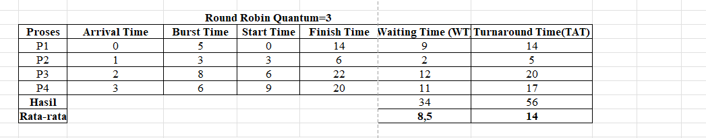
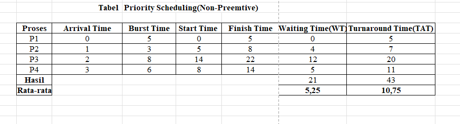
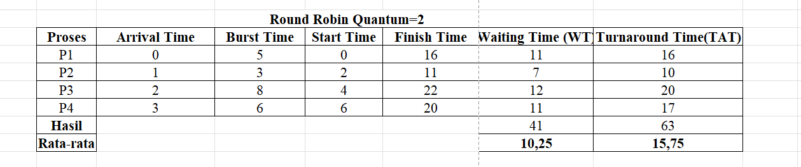

# Laporan Praktikum Minggu [6]
Topik: [ Penjadwalan CPU – Round Robin (RR) dan Priority Scheduling]

---

## Identitas
- **Nama**  : [Asyifani Lutfiana Nadzif]  
- **NIM**   : [250202931]  
- **Kelas** : [1IKRB]

---

## Tujuan
Tuliskan tujuan praktikum minggu ini.  
Contoh:  
1. Menghitung waiting time dan turnaround time pada algoritma RR dan Priority.
2. Menyusun tabel hasil perhitungan dengan benar dan sistematis.
3. Membandingkan performa algoritma RR dan Priority.
4. Menjelaskan pengaruh time quantum dan prioritas terhadap keadilan eksekusi proses.
5. Menarik kesimpulan mengenai efisiensi dan keadilan kedua algoritma.


---

## Dasar Teori
- Penjadwalan CPU adalah mekanisme dalam sistem operasi untuk menentukan proses mana yang mendapatkan jatah penggunaan CPU pada suatu waktu
- Round Robin (RR) adalah algoritma penjadwalan preemptive yang memberikan jatah waktu (time quantum) yang sama kepada setiap proses secara bergiliran. Ketika waktu proses habis, CPU dialihkan ke proses berikutnya dalam antrian.
- Priority Scheduling adalah algoritma penjadwalan yang mengeksekusi proses berdasarkan tingkat prioritas. Proses dengan prioritas tertinggi akan dijalankan terlebih dahulu.


---

## Langkah Praktikum
1. Menyiapkan data proses
2. Melakukan Eksperimen 1 RR(Round Robin) Dengan Quantum= 3 dan membuat Gant chart dan membuat perhitungan WT dan TAT.
3. Melakukan Eksperimen 2 PR (Priority Scheduling) di urutkan berdasarkan prioritas tertinggi hingga terkecil yang telah tiba di antrian.
4. Melakukan Eksperimen 3 dengan mencari RR(Round Robin) dengan Quantum= 2 dan 5 dengan Gant Chartnya
5. Mendokumentasikan seluruh eksperimen 
6. Lalu push di GitHub 

---

## Kode / Perintah
Tuliskan potongan kode atau perintah utama:
```bash
WT[i] = waktu mulai eksekusi - Arrival[i]
TAT[i] = WT[i] + Burst[i]
```

---

## Hasil Eksekusi

## Eksperimen 1 Round Robin Quantum=3
Setiap proses mendapat jatah waktu yang sama yaitu 3, jika proses belum selesai dalam 3 waktu proses akan masuk antrian lagi dengan memberikan jatah eksekusi secara bergantian.


Gant Chart:
```Bash 
| P1 | P2 | P3 | P4 | P1 | P3 | P4 | 
0    3    6    9   12   14   17    20  
```

## Eksperimen 2 Priority Scheduling 

Gant Chart:
```Bash 
| P1 | P2 | P3 | P4 |
0    5    8    14   22 
```
## Eksperimen 3 Variasi Time Quantum

Gant Chart:
```Bash 
| P1 | P2 | P3 | P4 | P1 | P2 | P3 | P4 | P1 | P3 | P4 | P3 |
0    2    4    6    8    10   11   13   15   16   18   20   22

``` 

Gant Chart:
```Bash 
| P1 | P2 | P3 | P4 | P3 | P4|
0    5    8    13   18   21  22
```
---
## Eksperimen 4
| Algoritma | Avg Waiting Time | Avg Turnaround Time | Kelebihan | Kekurangan |
|------------|------------------|----------------------|------------|-------------|
| **RR** | **8,5** | **14** | Adil terhadap semua proses | Tidak efisien jika quantum tidak tepat |
| **Priority**| **5,25** | **10,75**| Efisien untuk proses penting | Potensi *starvation* pada prioritas rendah | 
## Analisis
1. Perbandingan Performa:
  - Waiting Time 
  >- Priority(**5,25**)lebih rendah di banding RR(**8,5**) menunjukan bahwa proses dengan prioritas tinggi bisa di esksekusi lebih cepat. 
  - Turnaround Time
  >- Priority (**10,75**)lebih rendah dari RR(**14**) Algoritma Priority  lebih cepat menyelesaikan proses dari awal sampai selesai.
2. Pengaruh Time Quantum adalah jatah waktu yang diberikan kepada setiap proses sebelum CPU berpindah ke proses berikutnya.
3. Pengaruh Prioritas adalah setiap proses memiliki nilai prioritas,semakin tinggi prioritas semakin cepat proses tersebut dijalankan


---

## Kesimpulan
- Round Robin menekankan fairness dengan membagi waktu CPU secara merata menggunakan time quantum.
- Priority Scheduling menekankan kepentingan proses sehingga proses penting selesai lebih cepat.
- Kedua algoritma memiliki kelebihan dan kekurangan, dan pemilihannya tergantung kebutuhan sistem.

---

## Quiz
1. Apa perbedaan utama antara Round Robin dan Priority Scheduling?  
   **Jawaban:** 
   - Perbedaan utama antara Round Robin (RR) dan Priority Scheduling terletak pada dasar penentuan proses mana yang akan dieksekusi oleh CPU.RR mendasarkan keputusannya pada waktu, sedangkan Priority Scheduling mendasarkannya pada nilai kepentingan proses. 
2. Apa pengaruh besar/kecilnya time quantum terhadap performa sistem? 
   **Jawaban:**  
   - Pengaruh besar atau kecilnya time quantum (q) dalam algoritma penjadwalan Round Robin (RR) sangat signifikan terhadap performa sistem, terutama memengaruhi overhead sistem dan waktu respons serta keadilan (fairness).
3. Mengapa algoritma Priority dapat menyebabkan starvation?  
   **Jawaban:**  
   - Priority Scheduling dapat menyebabkan kondisi Kelaparan (Starvation) karena sifatnya yang berfokus pada kepentingan, dan bukan pada waktu tunggu.

---

## Refleksi Diri
Tuliskan secara singkat:
- Apa bagian yang paling menantang minggu ini?  Dalam Menentukan finish Time di RR.
- Bagaimana cara Anda mengatasinya? Menggunakan Aplikasi Bantu dan tanya ke Teman. 

---

**Credit:**  
_Template laporan praktikum Sistem Operasi (SO-202501) – Universitas Putra Bangsa_
