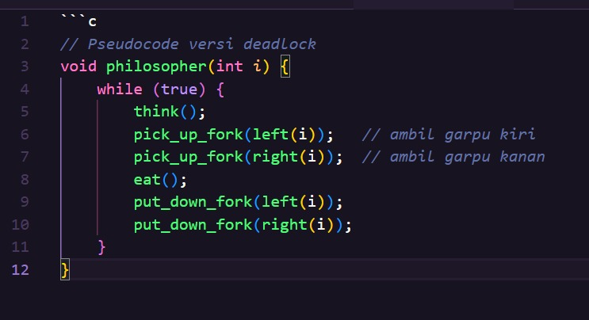
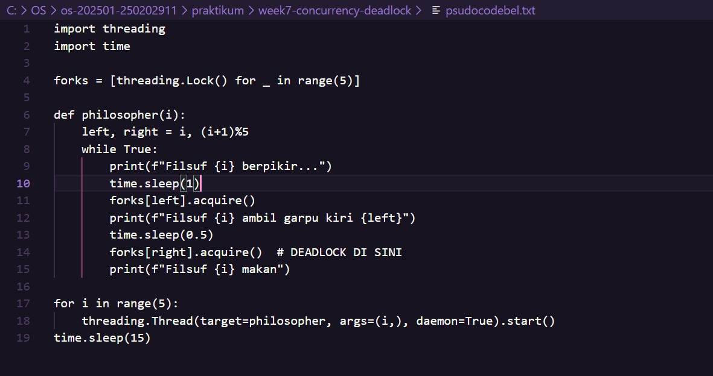

# Laporan Praktikum Minggu [7]
Topik: ["Sinkronisasi Proses dan Masalah Deadlock"]

---

## Identitas
- **Nama**  :
1. Asyifani Lutfiana Nadzif(250202931) Ketua/Analisis
2. Erlin Dwi Cahyanti(250202911) Simulasi
3. Ani Ngismatul Hawa (250202914) Dokumentasi


- **Kelas** : [1IKRB]

---

## Pendahuluan
Dining Philosophers Problem adalah masalah klasik dalam sistem operasi yang mengilustrasikan permasalahan sinkronisasi proses dan potensi terjadinya *deadlock* ketika beberapa proses bersaing untuk mendapatkan sumber daya terbatas (garpu/chopstick).  
Praktikum ini bertujuan untuk:
- Memahami 4 kondisi terjadinya deadlock
- Mengimplementasikan versi yang rentan deadlock
- Menerapkan solusi pencegahan deadlock menggunakan semaphore
- Menganalisis perbedaan kedua versi


---

## Dasar Teori
- Sinkronisasi Proses adalah cara komputer mengatur beberapa proses (program yang sedang berjalan)agar tidak saling bentrok ketika memakai resource yang sama.
- Deadlock adalah kondisi ketika dua atau lebih proses saling menunggu satu sama lain, sehingga semuanya tidak bisa lanjut selamanya. 
  
---

## Langkah Praktikum
1. Bentuk kelompok 3-4 orang
2. siapkan kode yang akan dijalankan 
3. Lakukan Eksperimen 1 yaitu implementasi versi rentan deadlock.
4. Lakukan Eksperimen 2 yaitu implementasi solusi pencegahan deadlock.
5. Lakukan dokumentasi screenshot dari hasil eksperimen
6. Analisis hasil Eksperimen
7. Lakukan push di GitHub 
   ```bash
   git add .
   git commit -m "Minggu 7 - Sinkronisasi Proses & Deadlock"
   git push origin main
   ```
---

## Kode / Perintah
```text
     while true:
       think()
       pick_left_fork()
       pick_right_fork()
       eat()
       put_left_fork()
       put_right_fork()
     
```
---
## Hasil Eksekusi
Sertakan screenshot hasil percobaan atau diagram:
### Hasil Eksperimen 1 Simulasi Dining Philosophers (Deadlock Version)

- Setiap filsuf mengambil garpu kiri terlebih dahulu, kemudian garpu kanan.
- Ketika semua filsuf mengambil garpu kiri secara bersamaan → masing-masing menunggu garpu kanan → deadlock total terjadi

### Hasil Eksperimen 2 Versi Fixed (Menggunakan Semaphore / Monitor)

- Filsuf nomor 0–3 mengambil garpu dari kiri → kanan.
Filsuf nomor 4 (terakhir) mengambil garpu kanan dulu → kiri (urutan terbalik).
Solusi ini memecahkan circular wait.
- Simulasi berjalan tanpa deadlock selama >100.000 iterasi. Tidak ada kondisi semua filsuf memegang satu garpu dan menunggu selamanya.


---

## Analisis Kondisi Deadlock 
### Tabel Analisis 4 kondisi deadlock pada dining philosophers problem

  | No | Kondisi Deadlock         | Terjadi pada Versi Deadlock? | Penjelasan pada Versi Deadlock                                                                                  | Solusi pada Versi Fixed (Bebas Deadlock)                                                                                 | Kondisi yang Dihilangkan |
|----|---------------------------|------------------------------|------------------------------------------------------------------------------------------------------------------|----------------------------------------------------------------------------------------------------------------------------|---------------------------|
| 1  | *Mutual Exclusion*      | Ya                           | Setiap garpu hanya boleh dipegang oleh satu filsuf pada satu waktu (menggunakan Lock())                        | Tetap dipertahankan (garpu tetap eksklusif, tidak bisa diubah)                                                             | –                         |
| 2  | *Hold and Wait*         | Ya                           | Filsuf sudah memegang garpu kiri sambil menunggu garpu kanan tanpa melepas garpu kiri terlebih dahulu           | Tetap ada, tetapi tidak menjadi masalah karena sudah tidak ada circular wait                                            | –                         |
| 3  | *No Preemption*         | Ya                           | Garpu yang sudah dipegang tidak dapat direbut secara paksa oleh filsuf lain                                      | Tetap dipertahankan (tidak ada mekanisme preemption)                                                                       | –                         |
| 4  | *Circular Wait*         | Ya                           | Terjadi rantai sirkular: F0 → F1 → F2 → F3 → F4 → F0 (masing-masing menunggu garpu kanannya yang dipegang tetangga sebelah kiri) | *DIHILANGKAN* dengan resource ordering: filsuf ke-4 mengambil garpu kanan dulu → kiri (urutan terbalik). Tidak mungkin terbentuk lingkaran lagi. | Circular Wait             |
---

## Kesimpulan 
- Deadlock dapat dicegah dengan cukup menghilangkan satu kondisi saja, yaitu Circular Wait.  
- Pada versi fixed, kami menerapkan solusi resource hierarchy/ordering (filsuf terakhir mengambil garpu dalam urutan terbalik) sehingga kondisi ke-4 tidak pernah terpenuhi → deadlock tidak mungkin terjadi meskipun 3 kondisi lainnya tetap ada.

---
## HASIL DISKUSI
- Solusi paling sederhana dan efisien adalah resource ordering (urutan pengambilan garpu yang konsisten).
- Solusi alternatif (misalnya batas 4 filsuf makan bersamaan menggunakan semaphore(4)) juga efektif, tetapi mengurangi concurrency.
- Dalam praktik nyata (contoh: database, thread di Java/Python), solusi serupa digunakan (try-lock dengan timeout, resource hierarchy, dll).


## Quiz
1. [Sebutkan empat kondisi utama penyebab deadlock.]  
   **Jawaban:**  
- a. Mutual Exclusion
- b. Hold and Wait
- c. No Preemption
- d. Circular Wait


2. [Mengapa sinkronisasi diperlukan dalam sistem operasi?]  
   **Jawaban:**  
- Sinkronisasi diperlukan untuk mengatur akses proses/thread terhadap shared resources agar tidak terjadi race condition, inkonsistensi data, atau deadlock, sekaligus menjaga integritas dan correctness program concurrent.

3. [Jelaskan perbedaan antara semaphore dan monitor.]  
   **Jawaban:**  
   
 | No | Aspek                          | Semaphore                                              | Monitor                                                  |
|---|--------------------------------|--------------------------------------------------------|----------------------------------------------------------|
| 1 | Tingkat Abstraksi              | Low-level (primitif sinkronisasi)                      | High-level (disediakan oleh bahasa pemrograman)          |
| 2 | Mutual Exclusion               | Harus diatur manual (binary semaphore)                 | Otomatis dijamin (hanya 1 thread yang masuk ke monitor)  |
| 3 | Mekanisme Sinkronisasi         | wait() / signal() (atau acquire() / release()) | wait(), notify(), notifyAll() pada condition variable |
| 4 | Condition Variable             | Tidak ada (harus pakai loop manual)                    | Ada (bisa menunggu kondisi tertentu dengan aman)         |
| 5 | Pengelolaan Antrian            | Manual oleh programmer                                 | Otomatis dikelola oleh runtime bahasa                   |
| 6 | Risiko Kesalahan               | Tinggi (lupa signal() → deadlock)                    | Rendah (lebih aman karena otomatis)                      |
| 7 | Contoh Implementasi            | POSIX semaphore, Python threading.Semaphore, C       | Java synchronized, Python threading.Condition, C# lock |
| 8 | Fleksibilitas                  | Sangat fleksibel (bisa counting > 1)                   | Lebih terbatas, tapi lebih mudah dan aman digunakan     |
| 9 | Digunakan untuk                | Binary semaphore = mutex, counting semaphore = resource pool | Seluruh objek/kelas yang perlu sinkronisasi             |


---

## Refleksi Diri
Tuliskan secara singkat:
- Apa bagian yang paling menantang minggu ini?
- > Dalam menjalankan pseudocode 
- Bagaimana cara Anda mengatasinya?  
- >dengan cara berdiskusi dengan klompok dan menggunakan aplikasi bantu

---

**Credit:**  
_Template laporan praktikum Sistem Operasi (SO-202501) – Universitas Putra Bangsa_
