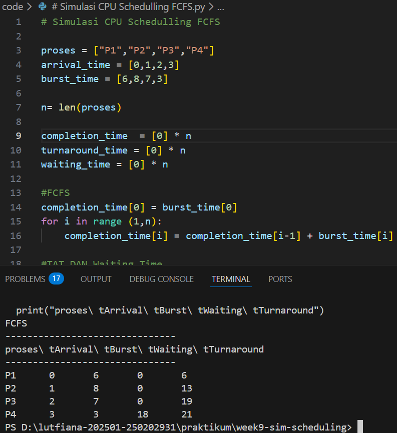

# Laporan Praktikum Minggu [9]
Topik: [ Simulasi Algoritma Penjadwalan CPU]

---

## Identitas
- **Nama**  : [Asyifani Lutfiana Nadzif]  
- **NIM**   : [250202931]  
- **Kelas** : [1IKRB]

---

## Tujuan
Tuliskan tujuan praktikum minggu ini.  
Contoh:  
>- Membuat program simulasi algoritma penjadwalan FCFS dan/atau SJF.
>- Menjalankan program dengan dataset uji yang diberikan atau dibuat sendiri.
>- Menyajikan output simulasi dalam bentuk tabel atau grafik.
---

## Dasar Teori
>1. penjadwalan CPU adalah sistem oprasi yang mengatur urutan eksekusi proses di dalam CPU.Karena CPU hanya dapat mengeksekusi satu proses pada satu waktu agar penggunaan CPU menjadi lebih efisien.
>2. simulasi algoritma penjadwalan CPU adalah proses pemodelan perilaku penjadwalan CPU menggunakan program komputer tanpa harus menjalankan sistem oprasi secara langsung.
>3. parameter penjadwalan CPU seperti:
>- Arrival Time
>- Burst Time
>- Completion Time
>- Turnaround Time
---

## Langkah Praktikum
1. Menyiapkan Dataset 
2. Implementasi algoritma menggunakan python
3. eksekusi dataset menggunakan program python 
4. screenshot hasil eksekusi
5. push di GitHub dengan Commit yg telah di sediakan 

---

## Kode / Perintah
Tuliskan potongan kode atau perintah utama:
```bash
# Simulasi CPU Schedulling FCFS 

proses = ["P1","P2","P3","P4"]
arrival_time = [0,1,2,3]
burst_time = [6,8,7,3]

n= len(proses)

completion_time  = [0] * n
turnaround_time = [0] * n
waiting_time = [0] * n 

#FCFS
completion_time[0] = burst_time[0]
for i in range (1,n):
    completion_time[i] = completion_time[i-1] + burst_time[i]

#TAT DAN Waiting Time 
for i in range(n):
 turnaround_time[i]= completion_time[i] - arrival_time[i]
waiting_time[i] = turnaround_time[i] - burst_time[i]

print("FCFS")
print("-------------------------------")
print("proses\ tArrival\ tBurst\ tWaiting\ tTurnaround")
print("-------------------------------")

for i in range (n):
    print(f"{proses[i]}\t{arrival_time[i]}\t{burst_time[i]}\t"
          f"{waiting_time[i]}\t{turnaround_time[i]}")
```

---

## Hasil Eksekusi
Sertakan screenshot hasil percobaan atau diagram:


---

## Analisis
- program simulasi CPU menggunakan algoritma FCFS. Proses dijalankan sesuai urutan waktu kedatangan (arrival time)tanpa preemption. Langkah kerja Program:
  1. program membaca data proses (arrival time dan burst time).
  2. proses dieksekusi satu per satu sesuai urutan kedatngan.
  3. program menghitung completion time.
  4. dari CT dihitung Turnaround Time dan Waiting Time.
  5. Hasil ditampilkan dalam bentuk tabel.
  ### Hasil Perhitungan 
| Proses | Arrival Time | Burst Time | Finish Time | TAT | WT |
 |:---:|:---:|:---:|:---:|:---:|:---:|
| P1 | 0 | 6 | 6 | 6 | 0 |
| P2 | 1 | 8 | 14 | 13 | 5 |
| P3 | 2 | 7 | 21 | 19 | 12 |
| P4 | 3 | 3 | 24 | 21 | 18 | 

### Perbandingan Hasil Simulasi 
>- nilai waiting time pada hasil simulasi sama persis dengan hasil perhitungan manual
>- nilai Turnaround Time pada hasil simulasi tidak ada perbedaan dengan perhitungan manual
>- hal ini menunjukan bahwa algoritma FCFS pada program telah diimplementasikan dengan benar.
 ### kelebihan dan keterbatasan simulasi 
 1. Kelebihan
   >- mudah dipahami
   >- aman dan tidak beresiko
   >- hasil perhitungan akurat
   >- efisien waktu
   >- mudah dikembangkan 
 2. Keterbatasan 
   >- tidak mempresentasikan kondisi nyata sepenuhnya
   >- bergantung pada dataset
   >- tidak mempertimbangkan prioritas proses
   >- kurang efisien untuk sistem real-time
   >- sederhana untuk skala
---

## Kesimpulan
1. simulasi algoritma penjadwalan CPU menggunakan metode FCFS  berhasil menghitung waiting time dan tunaround time secara otomatis dan hasilnya sesuai dengan perhitungan manual.
2. algoritma FCFS mudah dipahami sehingga cocok digunakan untuk pembelajaran dasar konsep penjadwalan CPU.
3. meskipun sederhana, algoritma FCFS memiliki keterbatasan karena dapat menghasilkan waktu tunggu yang besar dan kurang efisien untuk sitem yang membutuhukan respon cepat 

---

## Quiz
1. Mengapa simulasi diperlukan untuk menguji algoritma scheduling? 
   **Jawaban:**  
   simulasi di perlukan untuk menguji algoritma scheduling karena dapat membantu memahami cara kerja algoritma tanpa harus menjalankan sistem oprasi secara langsung. dengan simulasi,proses perhitungan seperti waiting time dan turnaround time dapat dilakukan secara aman,cepat, dan akurat, serta memudahkan dalam membandingkan kinerja beberapa algoritma penjadwalan.
2. Apa perbedaan hasil simulasi dengan perhitungan manual jika dataset besar? 
   **Jawaban:** 
   pada dataset kecil, hasil simulasi dan menual biasanya sama. namun, jika dataset besar,peghitungan manual menjadi sulit ,memakan waktu, berpotensi terjadi kesalahan. simulasi mampu menangani dataset besar dengan lebih cepat dan konsisten,sehingga hasilnya lebih efisien dan minim kesalahan dibandingkan peritungan manual. 
3. Algoritma mana yang lebih mudah diimplementasikan? Jelaskan.
   **Jawaban:**  
Algoritma FCFS merupakan algoritma yang paling mudah diimplementasikan karena proses dijalankan sesuai urutan kedatangan tanpa preemption.algoritma ini tidak memerlukan perhitungan tambahan atau pemilihan proses yang kompleks, sehingga cocok digunakan untuk dasar algoritma penjadwalan CPU.
---

## Refleksi Diri
Tuliskan secara singkat:
- Apa bagian yang paling menantang minggu ini?  
- Bagaimana cara Anda mengatasinya?  

---

**Credit:**  
_Template laporan praktikum Sistem Operasi (SO-202501) – Universitas Putra Bangsa_
